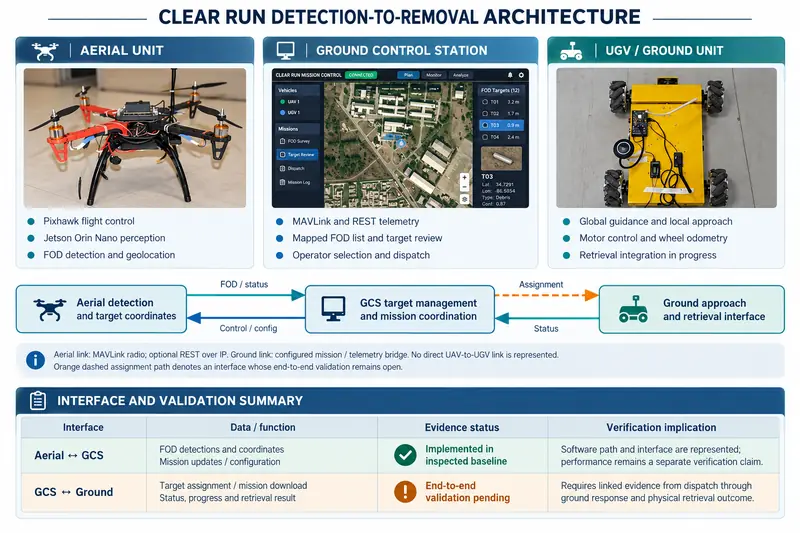
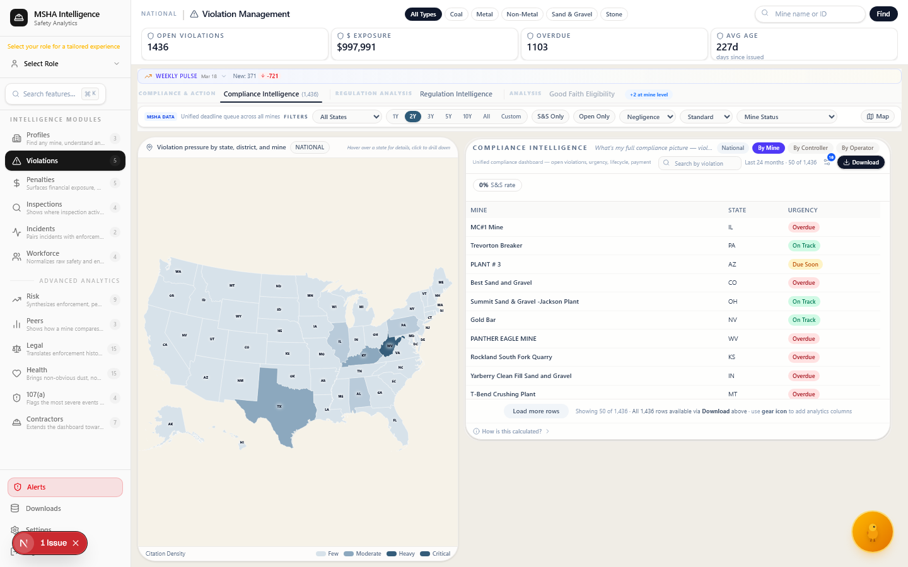

# Muhammad Umair Raza — Applied AI & Autonomous Systems Engineering Leader

**Autonomous / Embedded / Edge AI · Compliance / Regulatory Intelligence · Practical Agentic AI Products · AI Assurance / Evaluation / Digital Engineering**

**Current role:** Officer In Charge Projects / R&D & Systems Engineering Lead, College of Aeronautical Engineering, NUST · NUTECH assignments · **2023–present**

I lead and build **applied-AI systems as complete engineered systems**—from sensing/data and models/retrieval through interfaces, deployment, verification and field evidence. My primary current specialization is **autonomous / embedded / edge AI**, grounded in **18+ years of aerospace systems engineering and technical programme delivery**. In parallel, I am building specialist work in **compliance and regulatory intelligence**, **practical agentic AI products**, and cross-cutting **AI assurance, evaluation and digital engineering**.

**Career profile:** [AI-focused base resume](profile/AI_BASE_RESUME.md) · **LinkedIn:** [Profile](https://www.linkedin.com/in/mumairaza/) · **Research:** [Google Scholar](https://scholar.google.com/citations?user=0EVckyAAAAAJ&hl=en) · **Dataset:** [TIR-FOD v1.2](https://doi.org/10.5281/zenodo.22546586) · **Technical review:** [project-specific access](PRIVATE_REPOSITORY_ACCESS.md)

## Four specialization areas

| | |
|---|---|
| **[1. Autonomous, Embedded & Edge AI](#autonomy-edge-ai)** Primary engineering domain: computer vision, edge deployment, sensing, UAV/UGV integration and system-level verification. **Flagships:** Clear Run / TIR-FOD · Counter-UAS | **[2. Compliance & Regulatory Intelligence](#compliance-regtech)** Specialist product niche: authoritative-source consolidation, retrieval, analytics and bounded AI reasoning for regulated decisions. **Flagships:** i-MSHA · Lodestar |
| **[3. Practical Agentic AI Products](#practical-agentic-ai)** Independent product stream for recurring engineering, career, research and knowledge work with explicit state, provenance and human control. **Flagships:** JobLooper · BuildSignal AI · Adversarial Review Lite | **[4. AI Assurance, Evaluation & Digital Engineering](#assurance-digital-engineering)** Cross-cutting discipline connecting evaluation, release controls, MBSE, research computing and aerospace digital-thread engineering. **Flagships:** AI Systems Assurance / MBSE · Evaluation-driven AI workflows · ATLAS GPU/HPC · Super Mushshak digital engineering |

## At a glance

| Programme leadership | Hands-on AI / software | Systems foundation |
|---|---|---|
| Leads R&D / systems-engineering activity across a **100+ project portfolio** spanning AI, autonomy, avionics, radar/RF, communications, sensing and embedded systems | Python/backend implementation and review, computer vision, RAG/retrieval, AI evaluation, Jetson/TensorRT deployment, interfaces and test evidence | **18+ years** across aircraft development, avionics integration, flight-line/MRO engineering, international OEM integration, configuration, qualification and airworthiness |
| Supervised **60+ advanced engineering projects** | RGB/LWIR sensing, YOLO/SAHI, FastAPI, PostgreSQL/pgvector, BGE embeddings, RRF and structured AI workflows | Requirements, architecture, interfaces, V&V, configuration control, qualification and acceptance |
| Accountable technical leadership for the **22-node ATLAS GPU/HPC environment** | Held-out evaluation, failure analysis, deterministic guardrails, MBSE/Capella and regression criteria | Prototype-to-field engineering across aircraft development, upgrades, sustainment and digital-engineering reconstruction |

## Inspect the engineering

[**TIR-FOD reproducibility**](evidence/autonomy_edge_ai/tir_fod/reproducibility/README.md) · [**Clear Run field/mission evidence**](evidence/autonomy_edge_ai/clear_run/README.md) · [**Lodestar retrieval & evaluation**](evidence/compliance_regtech/lodestar/README.md) · [**JobLooper source**](https://github.com/razaumair2203-ux/Pub-JobLooper) · [**Adversarial Review Lite**](domains/03-practical-ai-products/adversarial-review-lite.md) · [**research record**](research/README.md) · [**engineering CI**](https://github.com/razaumair2203-ux/applied-ai-portfolio/actions/workflows/engineering-validation.yml)

**Technical review:** project-specific access uses a **curated, release-safe technical package or review branch** rather than automatically exposing raw working repositories. [Review options →](PRIVATE_REPOSITORY_ACCESS.md)

## 1. Autonomous, Embedded & Edge AI

**Primary technical specialization.** This is where the aerospace/systems background most directly converges with current AI work: perception, sensing, embedded compute, UAV/UGV integration, interfaces and system verification.

| Project family | Engineering contribution | Evidence-backed state |
|---|---|---|
| **[Clear Run / TIR-FOD](domains/01-autonomy-edge-ai/clear-run-tir-fod.md)** | UAV–GCS–UGV airfield robotics; RGB/LWIR perception; Jetson/TensorRT deployment; geolocation; operator tasking; developing physical recovery | flight-tested edge AI; active UAV–GCS–UGV integration; final physical-retention closure remains open |
| **[Counter-UAS Phase I](domains/01-autonomy-edge-ai/counter-uas.md)** | Physical AI-vision drone-detection prototype taken from model development into constructed sensing hardware and indoor/outdoor trials | Phase I completed; RF/acoustic/multisensor extensions remain research |

### Clear Run / TIR-FOD

**Private technical review available:** [request review](https://github.com/razaumair2203-ux/applied-ai-portfolio/issues/new?template=access-clear-run.yml)

Clear Run is an integrated airfield robotics programme from **detection → geolocation → operator review/tasking → UGV response → developing physical recovery**. Public evidence deliberately keeps intermediate success separate from verified mission completion.

**Evidence:** **3,499 source frames · 5,593 annotations · 23 classes · 29 controlled training runs**; field-tested Jetson Orin Nano/TensorRT deployment; current public field snapshot: **8 trial videos · 12 structured RGB events across 8 classes**. End-to-end physical-retention verification remains open.

**My contribution:** technical direction, architecture/interfaces, experiment and evaluation strategy, deployment review, integration/V&V gates and multidisciplinary team leadership. UAV/airframe integration, GCS/UGV implementation, field execution and mechanical recovery are team-developed outputs rather than sole-authorship claims.

### Counter-UAS Phase I

  
  

*Constructed Phase-I sensing hardware and retained outdoor detection evidence.*

Phase I produced a **constructed laser–camera sensing prototype** and preliminary indoor/outdoor trials using approximately **14,000 training images** and a **1,500-image test set**. My role was Principal Investigator / research direction and systems-integration oversight; RF/acoustic/multisensor extensions remain research.

[Explore the autonomous / edge-AI domain →](domains/01-autonomy-edge-ai/README.md)

## 2. Compliance & Regulatory Intelligence

**Specialist product niche.** The reusable engineering pattern is **authoritative source consolidation → structured evidence model → retrieval / analytics → bounded AI reasoning → cited decision support → human-controlled action**.

<table>
<tr>
<td width="50%"></td>
<td width="50%"></td>
</tr>
<tr>
<td><b>i-MSHA</b> Mine-safety compliance and decision intelligence built over governed public data.</td>
<td><b>Lodestar</b> Grounded EB-2 NIW / EB-1A evidence assessment with authority-aware retrieval and refusal controls.</td>
</tr>
</table>

*Visual provenance: i-MSHA is an authentic browser-regression snapshot from the project repository; Lodestar is a source-derived rendering from the current frontend code, not an original product screenshot.*

### i-MSHA

i-MSHA consolidates fragmented U.S. MSHA public data into a national→state→mine/controller decision environment. Retained May 2026 state: **8 active modules · 25 frontend features · 100 backend handlers · 385 Canary unit tests · 839 full backend tests passing**.

**My contribution:** product/programme direction, systems architecture, AI/data workflow definition, feature prioritisation, technical review and validation framing.

### Lodestar

Lodestar maps applicant evidence to EB-2 NIW / EB-1A criteria with authority-aware retrieval, gap analysis and bounded cited assessments. Recorded state: **209 documents · 2,945 chunks · a 34-query frozen retrieval regression set · 1 top-5 expected-source miss**, plus PostgreSQL/pgvector, authority-policy and adversarial-output regression evidence.

**My contribution:** system architecture, retrieval/evaluation design, implementation direction, reliability controls, technical validation and product integration. Coding-agent assistance is used in implementation; architecture, constraints, evaluation design, acceptance criteria and release decisions remain owner-directed and evidence-gated.

[Explore compliance / regulatory intelligence →](domains/02-compliance-regtech/README.md)

## 3. Practical Agentic AI Products

**Independent product stream.** These systems turn recurring work into explicit state, provenance, bounded agent action, independent checks where useful and human-controlled release.

<table>
<tr>
<td width="33%"></td>
<td width="33%"></td>
<td width="33%"></td>
</tr>
<tr>
<td><b>JobLooper</b> Evidence-governed job-application operating system.</td>
<td><b>BuildSignal AI</b> Governed research-to-publication operations.</td>
<td><b>Adversarial Review Lite</b> Independent second-model review with mutation and approval controls.</td>
</tr>
</table>

*Visual provenance: JobLooper and BuildSignal AI surfaces are source-derived renderings from their current application code; Adversarial Review Lite uses retained report evidence. These renderings are not presented as original product screenshots.*

**[JobLooper](domains/03-practical-ai-products/joblooper-jobpilot.md)** governs career truth, exact JD capture, gap/preflight decisions, AI-assisted tailoring, human approval, deterministic document build and outcome learning. [Public source →](https://github.com/razaumair2203-ux/Pub-JobLooper)

**[BuildSignal AI](domains/03-practical-ai-products/buildsignal-ai.md)** governs research/source capture, media state, rights/provenance, QA, review and owner-controlled publication.

**[Adversarial Review Lite](domains/03-practical-ai-products/adversarial-review-lite.md)** provides public cross-model review tools with frozen scope, mutation checks, re-verification and human approval.

[Explore practical agentic AI products →](domains/03-practical-ai-products/README.md)

## 4. AI Assurance, Evaluation & Digital Engineering

**Cross-cutting engineering discipline.** This area carries verification, evidence, lifecycle, evaluation and release discipline across the autonomy work, compliance products and practical agentic tools, while connecting current AI engineering to earlier aerospace systems experience.

<table>
<tr>
<td width="50%"></td>
<td width="50%"></td>
</tr>
<tr>
<td><b>Evaluation-driven AI workflows</b> Frozen cases, failure-mode checks, release safeguards and human approval.</td>
<td><b>Super Mushshak digital engineering</b> Completed aircraft retrofit engineering reconstructed into a traceable digital thread.</td>
</tr>
</table>

### AI Systems Assurance / MBSE — Clear Run

**[AI Systems Assurance / MBSE](domains/01-autonomy-edge-ai/ai-systems-assurance-mbse.md)** is Clear Run's cross-cutting verification layer: Capella/Arcadia architecture, producer-consumer replay, evidence applicability and regression obligations. It remains linked to the autonomy programme while classified here as assurance/digital engineering; INCOSE IACS editorial review is pending.

### Evaluation-driven AI workflows

A retained development lineage uses frozen train/validation/held-out cases, fabrication/date/metric checks, parser rescoring and materiality/statistical safeguards. One recorded prompt candidate was **blocked** because the measured improvement did not justify release.

### ATLAS GPU/HPC

**[ATLAS](domains/04-assurance-digital-engineering/atlas-hpc.md)** is a **22-node GPU/HPC research-computing environment** supporting AI, simulation and reproducible engineering workflows on Linux/Ubuntu, SLURM, CUDA and Docker. My role is accountable technical leadership for the environment and associated technical staff; individual research jobs remain team/project outputs.

### Super Mushshak — aerospace integration to digital engineering

The completed programme covered the **first three glass-cockpit prototypes** and aircraft-level avionics/display, electrical, interface, configuration and flight-test integration. The current follow-on reconstructs releasable records into a traceable digital thread; executable twin behaviour remains future work.

**My contribution:** lead systems engineer / avionics integration engineer on the historical retrofit and current retrospective systems modelling / digital-thread reconstruction.

[Public source repository →](https://github.com/razaumair2203-ux/Super-Mushshak-Glass-Cockpit-Modification) · [Explore assurance & digital engineering →](domains/04-assurance-digital-engineering/README.md)

## Research and external technical validation

| Public record | Status / contribution boundary |
|---|---|
| **Low-Latency Architectures for Real-Time Multi-Stream Object Detection** | IEEE ICoDT2 2025 · co-author · [DOI 10.1109/ICoDT269104.2025.11360736](https://doi.org/10.1109/ICoDT269104.2025.11360736) |
| **TK-Patch: Universal Top-K Adversarial Patches for Cross-Model Person Evasion** | IEEE ICoDT2 2025 · co-author · [DOI 10.1109/ICoDT269104.2025.11360694](https://doi.org/10.1109/ICoDT269104.2025.11360694) |
| **TIR-FOD v1.2** | public 23-class LWIR runway-FOD dataset · [DOI 10.5281/zenodo.22546586](https://doi.org/10.5281/zenodo.22546586) |
| **Adaptive Interference Suppression in GNSS Using an 8-Element CRPA Antenna Array** | accepted/presented at IBCAST 2026; no DOI/indexing claim until independently verifiable |
| **Evidence-linked MBSE for Clear Run** | submitted to INCOSE Applications & Case Studies on 16 September 2026; editorial review pending |
| **TIR-FOD manuscript** | IEEE Access revision in progress; not represented as published |

[Full research record →](research/README.md)

## Aerospace systems foundation

The AI work sits on top of a longer record of system development, integration and lifecycle responsibility:

- aircraft development / systems integration across JF-17 development and fleet programmes, international OEM systems-engineering work, AEW&C maintenance engineering and trainer-aircraft avionics;
- programme-level configuration, upgrade and airworthiness work across a **150+ aircraft** fleet;
- an indigenous aircraft subsystem progressed through development, qualification and production with **135+ units fielded**;
- systems engineering / avionics integration for the **first three Super Mushshak glass-cockpit prototypes**;
- accountable technical leadership for the **22-node ATLAS GPU/HPC environment** supporting AI, simulation and reproducible engineering workflows.

This foundation is why the work consistently separates **model output from system behaviour, demonstration from verification, and technical possibility from evidence-backed maturity**.

## Technical stack

**AI / computer vision:** Python · PyTorch / Ultralytics YOLO · SAHI · OpenCV · RGB/LWIR sensing · adversarial/evaluation workflows

**Edge / autonomy:** NVIDIA Jetson Orin Nano · TensorRT · CUDA · GStreamer · Pixhawk · MAVLink · GNSS · UAV/UGV integration

**RAG / backend / data:** FastAPI · PostgreSQL · pgvector · HNSW · PostgreSQL FTS · BGE / sentence-transformers · RRF · DuckDB · Parquet · REST APIs

**Product / platform:** Next.js · TypeScript · local-first Python/Node workflows · CI · structured provenance and release gates

**Systems / validation:** MBSE / Capella · requirements · interfaces · V&V · configuration management · qualification · test/acceptance evidence

## Repository map

[Career profile](profile/AI_BASE_RESUME.md) · [domains](domains/README.md) · [technical evidence](evidence/README.md) · [visual provenance](visuals/README.md) · [research](research/README.md)

## Provenance and claim boundary

Public implementation, dataset records, experiment summaries and sanitized code are linked directly where disclosure permits. Measurements that depend on private corpora or historical hardware runs are identified as such. Team-developed work is not presented as sole authorship, active work is separated from completed results, and private programme material remains outside the public repository.

**License / rights:** [LICENSE](LICENSE)
