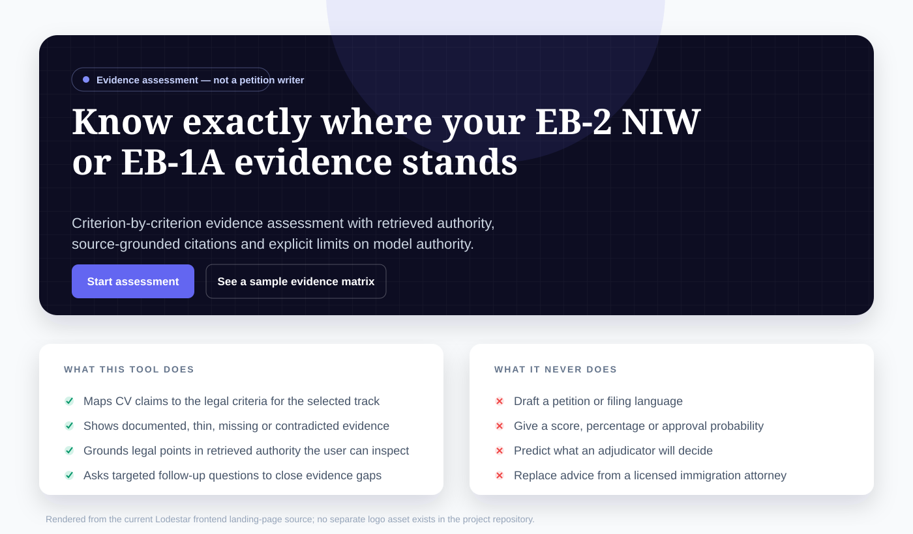
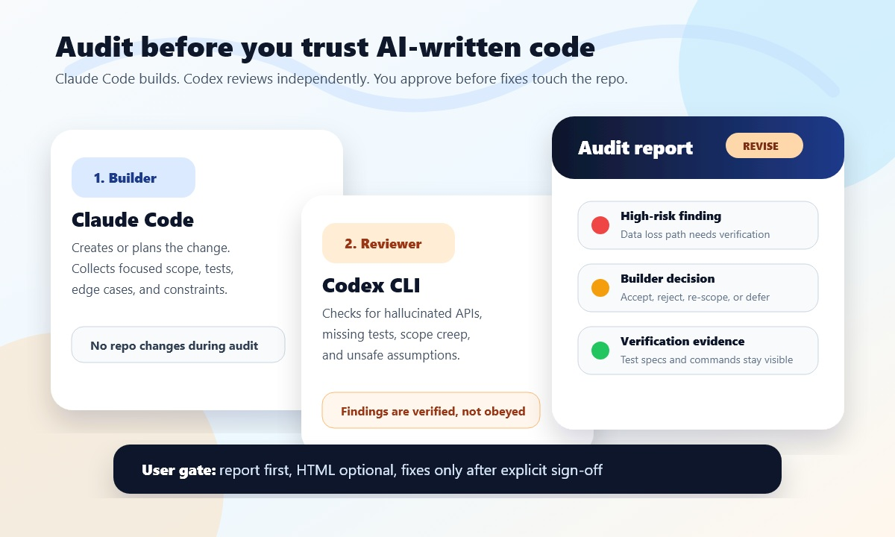
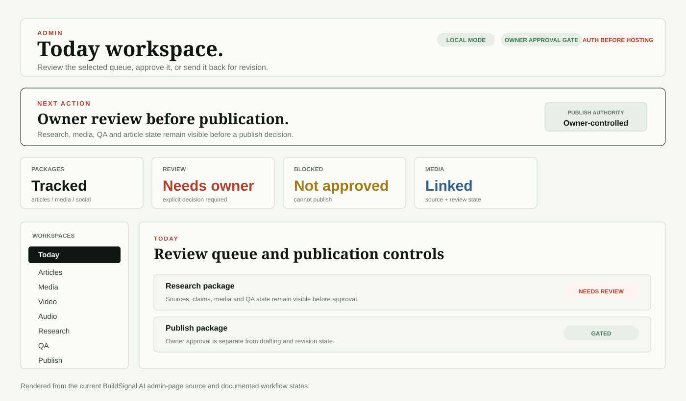

# Muhammad Umair Raza — AI / R&D Programme Leader · Applied AI Engineer · Aerospace Systems Engineer

**Engineering AI systems from data and models through deployment, interfaces, verification and field evidence.**

**Current role:** Officer In Charge Projects / R&D & Systems Engineering Lead, College of Aeronautical Engineering, NUST · NUTECH assignments · **2023–present**

I lead multidisciplinary engineering and applied-AI programmes while remaining technically hands-on in **system architecture, Python/backend implementation and review, computer vision, RAG/retrieval, AI evaluation, Jetson/TensorRT deployment, interfaces, verification and release controls**.

My foundation is **18+ years in aircraft systems development, avionics integration, V&V, configuration/lifecycle engineering and technical programme delivery**. Current work extends that discipline into edge AI, autonomous systems, grounded GenAI/RAG, AI assurance, digital engineering and data-intensive products.

**Career profile:** [AI-focused base resume](profile/AI_BASE_RESUME.md) · **LinkedIn:** [Profile](https://www.linkedin.com/in/mumairaza/) · **Research:** [Google Scholar](https://scholar.google.com/citations?user=0EVckyAAAAAJ&hl=en) · **Dataset:** [TIR-FOD v1.2](https://doi.org/10.5281/zenodo.22546586)

## At a glance

| Leadership scale | Hands-on technical work | Differentiating foundation |
|---|---|---|
| Leads R&D / systems-engineering activity across a **100+ project portfolio** spanning AI, autonomy, avionics, radar/RF, communications, sensing and embedded systems | Python/backend implementation and review, retrieval/evaluation logic, computer-vision experiments, structured AI workflows, interface analysis and test evidence | **18+ years** across aircraft development, avionics integration, flight-line/MRO engineering, international OEM integration, configuration, qualification and airworthiness |
| Supervised **60+ advanced engineering projects** | Jetson Orin Nano / TensorRT deployment, RGB/LWIR sensing, YOLO/SAHI, FastAPI, PostgreSQL/pgvector, BGE embeddings and RRF | Systems architecture, requirements, interfaces, V&V, configuration control, qualification and acceptance |
| Accountable technical leadership for the **22-node ATLAS GPU/HPC environment** | Held-out evaluation, failure analysis, deterministic guardrails, MBSE/Capella, regression criteria and system-boundary verification | Aircraft/fleet programmes spanning prototype development through production, fielding, upgrades and sustainment |

The through-line is **programme leadership + hands-on AI engineering + aerospace-grade systems discipline**: model performance matters, but so do data lineage, interfaces, configuration identity, evidence quality, failure modes and the boundary between a subsystem result and a verified system capability.

## Applied AI, autonomy and digital engineering

The work spans deployed edge vision, grounded RAG, AI assurance, regulatory intelligence, local-first AI workflows, autonomy integration and digital engineering. Each case states the current system maturity and the verification that remains open.

| Project family | What was built / why it matters | My role | Evidence-backed state |
|---|---|---|---|
| **[Clear Run / TIR-FOD](projects/tir-fod-clear-run.md)** | **Integrated airfield robotics programme** that closes the chain from RGB/LWIR runway-FOD sensing and Jetson/TensorRT inference to target geolocation, GCS review/tasking, UGV approach and physical recovery. It includes a public 23-class thermal dataset, controlled model research, real UAV deployment and active detection-to-retention verification—not a detector-only demo. | research/programme leadership, systems architecture & integration, experiment/V&V strategy, deployment review | flight-tested edge AI and active UAV–GCS–UGV integration; physical retrieval closure still in progress |
| **[Lodestar](projects/lodestar.md)** | **Full-stack EB-2 NIW / EB-1A evidence-assessment SaaS**. Applicants can upload evidence, map it to Dhanasar/Kazarian legal criteria, retrieve controlling sources and AAO decisions, identify gaps and receive structured cited assessments. The system explicitly refuses unsupported/citation-invalid conclusions and does not manufacture approval scores or a finished petition. | system architecture, legal-RAG retrieval/evaluation design, implementation direction, reliability controls | working private browser product with real corpus, end-to-end flow and public-safe retrieval/control evidence |
| **[i-MSHA](projects/msha-compliance-ai.md)** | **U.S. mine-safety intelligence and MSHA data-consolidation platform** spanning mine/controller profiles, violations, penalties, inspections, injury/safety, legal intelligence, occupational exposure, contractor intelligence, acquisition due diligence, comparison/weekly-pulse tooling and Canary AI. The engineering challenge is turning fragmented public MSHA data into one navigable national→state→mine decision environment. | product/programme direction, systems architecture, AI/data workflow definition, technical review, validation framing | 8 active modules · 25 frontend features · 100 backend handlers; private product in pre-deployment hardening |
| **[JobLooper](projects/joblooper-jobpilot.md)** | **Evidence-governed job-application operating system**: approved career truth → exact JD capture → gap/preflight decisions → AI-assisted tailoring → complete human review → deterministic DOCX/PDF build → hash-bound submission record → outcome learning. AI can assist reasoning, but cannot rewrite truth, self-approve or silently release documents. | product/system design, AI-workflow governance, evaluation and release controls | public local-first implementation plus private evaluation/development lineage |
| **[Adversarial Review Lite](projects/codex-adversarial-review-lite.md)** | **Cross-model assurance layer for AI-written software**. Claude↔Codex companion tools freeze review scope, pass test/rubric context, capture mutation hashes, run an independent reviewer, re-validate every finding and require human approval before code changes. | AI-assurance workflow design, reviewer contracts, cross-platform execution and release controls | two public cross-platform companion tools with self-test, report and safety model |
| **[BuildSignal AI](projects/buildsignal-ai.md)** | **AI-native research-to-publication operations system** for technical content: source capture, research logging, article/media/audio/video/social state, QA, rights/provenance, review and explicit owner-controlled publication. The product treats AI content generation as one component inside a governed operating workflow. | product direction, AI workflow design, source/review policy, quality governance | active private platform; local admin workflow implemented, hosted auth/media automation still open |
| **[Counter-UAS Phase I](projects/counter-uas.md)** | **Completed physical AI-vision drone-detection prototype**: constructed laser–camera sensing mount, model development using ~14,000 training images, a 1,500-image test set, and indoor/outdoor trials. It provides the experimental base for a later visual/RF/acoustic multisensor monitoring research programme without claiming the later phases as complete. | Principal Investigator / research direction, prototype and systems-integration oversight | Phase I completed; passive-RF/acoustic/multisensor extensions remain research |
| **[AI Systems Assurance / MBSE](projects/mbse-ai-assurance.md)** | **Evidence-linked assurance model for an AI/autonomy mission system**, connecting functions, interfaces, requirements, configuration and verification to the Clear Run detection→removal chain. A producer-consumer replay exposed a concrete telemetry truncation failure mode and converted it into explicit acceptance requirements. | systems modelling, interface/V&V framing, evidence applicability, regression logic | current Capella/Arcadia assurance case; INCOSE IACS submission pending review |
| **[Super Mushshak digital engineering](projects/super-mushshak-digital-engineering.md)** | **Completed aircraft-level glass-cockpit integration programme for the first three prototypes**, covering avionics/sensor integration, electrical and wiring changes, ARINC interfaces, configuration, installed-aircraft tests, flight-test feedback and customer evaluation; now reconstructed into a public-safe digital thread linking evidence→requirements→interfaces→configuration→verification→decisions. | historical lead systems/avionics integration role; current retrospective modelling | retrofit completed; digital-thread backbone implemented; executable twin behaviour remains future work |

[Complete project inventory and maturity map →](projects/README.md)

## Flagship systems and evidence

Original hardware, field media, product UI and public technical evidence are shown wherever they can be released. Source-derived interface renders are labelled directly when the underlying product remains private.

### Clear Run / TIR-FOD — airfield robotics from detection to verified removal

**System value:** a real detection-to-removal airfield robotics chain: thermal/RGB sensing, dataset and model engineering, Jetson/TensorRT deployment, target geolocation, operator/GCS decision support, UGV dispatch and developing physical recovery. The portfolio separates every intermediate success from verified end-to-end removal.

*Current Clear Run architecture from the reviewed Research Outreach/NRPU set. The composition embeds the actual UAV photograph, the native Clear Run GCS interface capture and the actual UGV photograph while keeping open assignment/retrieval validation paths explicit.*

  
  

*Airborne prototype and representative recorded RGB/LWIR inference outputs from field trials.*

Key engineering evidence:

- **3,499 source frames · 5,593 annotations · 23 classes · 29 controlled training runs**.
- Controlled leakage experiment: **+8.52 percentage-point invalid mAP uplift** when source lineage is violated.
- Jetson Orin Nano / FP16 TensorRT historical measurement: **25.0 FPS model stage · 15.6 FPS complete pipeline**.
- Current Clear Run evidence snapshot: **8 unique trial videos** and **12 structured RGB events across 8 reported classes**, with image location, target coordinates, UAV pose and altitude recorded.
- GCS→UGV acknowledgement, terminal alignment, physical capture and post-movement retention remain explicit verification gates rather than assumed mission success.
- Clear Run also has an [evidence-linked MBSE assurance case](projects/mbse-ai-assurance.md) covering system boundaries, interface requirements and regression obligations.

[Open the Clear Run / TIR-FOD case →](projects/tir-fod-clear-run.md)

### AI Systems Assurance / MBSE — evidence linked to system boundaries

  
  

  

*Subsystem views from the selected Research Outreach architecture set. They retain the real project UAV and UGV photographs and the native GCS interface capture; the architecture overlays show functions, interfaces and still-open validation paths.*

The assurance case separates detection, geolocation, operator review, ground-vehicle tasking, terminal approach, capture and retained removal into distinct claims with distinct evidence obligations. The current model records **3 mission components · 14 allocated logical functions · 13 logical functional exchanges** and a reproducible formatter/parser replay that exposed interface failure modes without treating constructed software cases as flight incidents. The practitioner case was submitted to **INCOSE Applications & Case Studies on 16 September 2026**; review remains pending.

[Open the AI Systems Assurance / MBSE case →](projects/mbse-ai-assurance.md)

### Lodestar — EB-2 NIW / EB-1A evidence-assessment SaaS

**System value:** a browser-based immigration evidence-assessment product that maps applicant records to EB-2 NIW / EB-1A legal criteria, retrieves authority, builds cited evidence/gap assessments and refuses unsupported conclusions. FastAPI, BGE embeddings, PostgreSQL/pgvector, FTS, HNSW and RRF are the implementation stack—not the product description.

*Source-derived rendering of the current Lodestar landing page. The private product does not expose a distributable product screenshot or separate logo asset.*

Recorded engineering state includes **209 documents · 2,945 chunks · a 34-query frozen retrieval regression set · 1 top-5 expected-source miss**. Public fixtures exercise PostgreSQL + pgvector retrieval, authority-policy ablation, an 11-invariant reliability regression and adversarial structured-output controls.

[Open the Lodestar case →](projects/lodestar.md) · [Inspectable implementation evidence →](evidence/lodestar/README.md)

### i-MSHA — national MSHA data consolidation and mine-safety decision platform

  

*Official project wordmark and an authentic browser-regression dashboard snapshot from the product test suite.*

The product consolidates fragmented U.S. MSHA public data into one national→state→mine operating environment covering mine/controller intelligence, violations, penalties, inspections, safety/injury, legal outcomes, occupational exposure, contractors, acquisition due diligence, comparisons and weekly pulse. **Next.js + FastAPI + PostgreSQL + DuckDB/Parquet** support the application and analytical layers; Canary AI sits across the system rather than replacing deterministic data logic. Current source-of-truth status records **8 active modules · 25 frontend features · 100 backend handlers**, with **385 Canary unit tests and 839 full backend tests passing** as of 20 May 2026.

**Current boundary:** deployment work remains open in the product plan; production deployment, customer UAT and regulatory certification are not claimed.

[Open the i-MSHA case →](projects/msha-compliance-ai.md)

### JobLooper — evidence-governed job-application operating system

  

*Official JobLooper mark and a source-derived rendering of the current public dashboard.*

The public system keeps career truth, provenance, workflow state and release authority outside unconstrained model output. The wider development/evaluation lineage includes frozen **20 train / 15 validation / 15 held-out** cases, separate fabrication/date/metric checks, parser rescoring and safeguards that can block statistically unsupported changes.

[Open the JobLooper case →](projects/joblooper-jobpilot.md) · [Evaluation case →](projects/ai-evaluation-workflows.md) · [Public repository →](https://github.com/razaumair2203-ux/Pub-JobLooper)

### Adversarial Review Lite — independent AI review as an engineering control

*Original report preview from the public Codex Adversarial Review Lite project.*

The companion public tools support both directions:

- [Claude builds → Codex reviews](https://github.com/razaumair2203-ux/codex-adversarial-review-lite)
- [Codex builds → Claude reviews](https://github.com/razaumair2203-ux/claude-adversarial-review-lite)

Both retain frozen review scope, mutation checks, structured findings, builder verification and human authority before fixes.

[Open the AI-assurance case →](projects/codex-adversarial-review-lite.md)

### Counter-UAS Phase I — physical AI-vision prototype and multisensor research foundation

  
  

*Left: the constructed Phase-I laser–camera sensing mount from the original project record. Right: retained outdoor detection output from the completed demonstrator.*

Phase I progressed from model training into a **constructed laser–camera sensing setup**, with approximately **14,000 training images**, a **1,500-image test set** and preliminary indoor/outdoor detection trials under the user's PI leadership. The hardware photograph is a publication-sized derivative of the original project image; only orientation, resize, compression and minor photographic correction were applied. Passive-RF, acoustic and wider multisensor concepts remain separate future research directions.

[Open the Counter-UAS case →](projects/counter-uas.md)

### BuildSignal AI — governed AI research / editorial operations

*Source-derived rendering of the current BuildSignal admin workspace. Research, media, QA and publication remain separate reviewable states with owner-controlled release.*

[Open the BuildSignal AI case →](projects/buildsignal-ai.md)

### Super Mushshak — first three glass-cockpit prototypes to a traceable digital thread

  

*Original Dynon SkyView prototype cockpit from the public project record.*

The completed retrofit covered aircraft-level sensing, avionics/display integration, interfaces, electrical installation, configuration, installed-aircraft checks and flight-test feedback. The current follow-on has converted releasable historical records into a structured public digital thread linking requirements, interfaces, configurations, verification and decisions; executable twin behaviour remains future work.

[Open the digital-engineering case →](projects/super-mushshak-digital-engineering.md) · [Public source repository →](https://github.com/razaumair2203-ux/Super-Mushshak-Glass-Cockpit-Modification)

## Research and external technical validation

| Public record | Status |
|---|---|
| **Low-Latency Architectures for Real-Time Multi-Stream Object Detection** | IEEE ICoDT2 2025 · [DOI 10.1109/ICoDT269104.2025.11360736](https://doi.org/10.1109/ICoDT269104.2025.11360736) |
| **TK-Patch: Universal Top-K Adversarial Patches for Cross-Model Person Evasion** | IEEE ICoDT2 2025 · [DOI 10.1109/ICoDT269104.2025.11360694](https://doi.org/10.1109/ICoDT269104.2025.11360694) |
| **TIR-FOD v1.2** | public 23-class LWIR runway-FOD dataset · [DOI 10.5281/zenodo.22546586](https://doi.org/10.5281/zenodo.22546586) |
| **Adaptive Interference Suppression in GNSS Using an 8-Element CRPA Antenna Array** | accepted/presented at IBCAST 2026; no DOI/indexing claim until independently verifiable |
| **Evidence-linked MBSE for Clear Run** | submitted to INCOSE Applications & Case Studies on 16 September 2026; editorial review pending |
| **TIR-FOD manuscript** | IEEE Access revision in progress; not represented as published |

[Full research record →](research/README.md)

## Aerospace systems foundation behind the AI work

The AI work sits on top of a longer record of system development, integration and lifecycle responsibility.

- **Aircraft development / systems integration:** JF-17 development and fleet programmes, international OEM systems-engineering work, AEW&C maintenance engineering and trainer-aircraft avionics development.
- **Configuration / lifecycle engineering:** programme-level configuration, upgrade and airworthiness work across a **150+ aircraft** fleet.
- **Prototype-to-field experience:** an indigenous aircraft subsystem progressed through development, qualification and production with **135+ units fielded**.
- **Aircraft retrofit:** led systems engineering / avionics integration for the **first three Super Mushshak glass-cockpit prototypes**.
- **Research infrastructure:** accountable technical leadership for the **22-node ATLAS GPU/HPC environment**, supporting AI, simulation and reproducible engineering workflows.

This background is why the portfolio repeatedly separates **model output from system behaviour, demonstration from verification, and technical possibility from evidence-backed maturity**.

## Engineering approach

- **Evaluation before claims:** source-aware splits, held-out sets, leakage checks, failure cases and explicit metric boundaries.
- **Deployment on the target platform:** model-stage timing is separated from complete pipeline throughput and field behaviour.
- **Interfaces as first-class engineering objects:** producer/consumer contracts, telemetry limits, GCS/vehicle hand-offs and configuration state are explicit.
- **Bounded AI authority:** provenance, source policy, validation, release and human approval stay outside unconstrained model output.
- **Inspectable evidence:** where disclosure permits, this repository publishes code extracts, fixtures, regression cases, data summaries and project-authentic visuals.

## Engineering evidence and reproducibility

The public CI exercises PostgreSQL + pgvector integration, Lodestar retrieval/control regressions, Clear Run field-evidence consistency, MBSE replay evidence, aggregate AI-evaluation evidence and TIR-FOD reproducibility/measurement boundaries.

## Technical stack

**AI / computer vision:** Python · PyTorch / Ultralytics YOLO · SAHI · OpenCV · RGB/LWIR sensing · adversarial/evaluation workflows

**Edge / autonomy:** NVIDIA Jetson Orin Nano · TensorRT · CUDA · GStreamer · Pixhawk · MAVLink · GNSS · UAV/UGV integration

**RAG / backend / data:** FastAPI · PostgreSQL · pgvector · HNSW · PostgreSQL FTS · BGE / sentence-transformers · RRF · DuckDB · Parquet · REST APIs

**Product / platform:** Next.js · TypeScript · local-first Python/Node workflows · CI · structured provenance and release gates

**Systems / validation:** MBSE / Capella · requirements · interfaces · V&V · configuration management · qualification · test/acceptance evidence

## Repository map

- **[profile/AI_BASE_RESUME.md](profile/AI_BASE_RESUME.md)** — AI-focused career profile with full engineering chronology
- **[projects/](projects/README.md)** — project families, roles, maturity and links
- **[evidence/](evidence/README.md)** — implementation extracts, evaluation fixtures and reproducibility records
- **[visuals/](visuals/README.md)** — original project media, official assets, product surfaces and engineering visuals
- **[research/](research/README.md)** — publications, datasets and active research status

## Provenance and claim boundary

Public implementation, dataset records, experiment summaries and sanitized code are linked directly where disclosure permits. Measurements that depend on private corpora or historical hardware runs are identified as such. Team-developed work is not presented as sole authorship, active work is separated from completed results, and private programme material remains outside this repository.

**License / rights:** [LICENSE](LICENSE)
