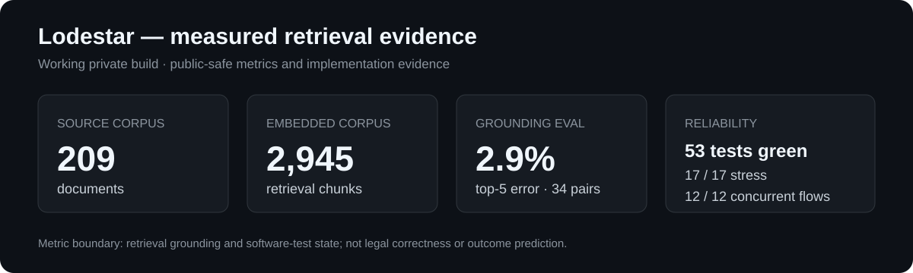

# M. Umair Raza — Applied AI Engineering Portfolio

**Applied AI · RAG / Retrieval · Computer Vision · Edge AI · GenAI Workflows · Aerospace Systems**

I lead applied engineering and R&D work at CAE/NUST, with current work spanning AI/ML, computer vision, autonomous systems, retrieval systems, GenAI workflows, embedded deployment and GPU/HPC-supported research. My earlier career adds 18+ years of operational aerospace, systems integration, V&V, fleet engineering and programme delivery.

This repository is the public evidence layer: **measured results, architecture, selected implementation code, tests, publications, datasets and deployment records**. It does not expose sensitive programme material or private user data.

## 60-second evidence

| Evidence | Measured / inspectable proof |
|---|---|
| **Grounded RAG / retrieval engineering — Lodestar** | **209 documents / 2,945 embedded chunks**; structure-aware chunking; BGE embeddings; PostgreSQL/Supabase + `pgvector`; HNSW cosine search; lexical retrieval; Reciprocal Rank Fusion; authority-aware reranking; citation-grounded outputs. **34 hand-checked grounding pairs; 2.9% top-5 retrieval error; 53 backend tests; 17/17 abuse/stress cases; 3/3 browser E2E flows; 12/12 concurrent full flows.** |
| **Operational edge AI — TIR-FOD / Clear Run** | **3,499 LWIR source frames, 5,593 annotations, 23 classes, 29 YOLO training runs.** Best observed three-seed YOLOv8n mAP@[.50:.95] **0.8603 ± 0.0017**. Controlled held-out-source contamination inflated mAP by **8.52 ± 0.19 percentage points**. Jetson Orin Nano/TensorRT UAV trials: **25.0 FPS inference / 15.6 FPS end-to-end** across ten runs. |
| **GenAI engineering — Codex Adversarial Review Lite** | Public multi-model review workflow with independent builder/reviewer roles, frozen scope, test contracts, model fallback, mutation checks, privacy preflight, structured verdicts and human approval before fixes. |
| **AI product engineering — JobLooper / JobPilot** | Local-first AI-assisted systems with governed evidence, deterministic validation, provider abstraction, provenance, release gates, browser workflow and document generation. Public JobLooper code; private JobPilot implementation summarized without exposing personal fixtures. |
| **Research output** | **Three peer-reviewed conference papers / conference records across 2025–2026**, including two IEEE Xplore DOI publications and an IBCAST 2026 GNSS/CRPA paper; **public TIR-FOD AI dataset** on Zenodo; IEEE Access TIR-FOD manuscript under revision. |

## Flagship systems

### 1. Lodestar — grounded RAG and evidence assessment

**Problem:** retrieve authoritative evidence from a heterogeneous legal/technical corpus without letting the LLM become the source of truth.

**Pipeline:** ingest → structure-aware chunking → BGE embeddings → PostgreSQL/Supabase storage → `pgvector` HNSW + full-text retrieval → RRF fusion → authority-aware reranking → citable evidence objects → grounded LLM assessment.

**Why it matters:** the engineering work is data structure, chunking, retrieval, ranking, evaluation, provenance, concurrency and failure handling—not merely an LLM call.

[Technical case study](projects/lodestar.md) · [Representative implementation evidence](evidence/lodestar/README.md) · [Measured grounding evaluation](evidence/lodestar/grounding-eval.md)

### 2. TIR-FOD / Clear Run — AI for runway inspection and retrieval

TIR-FOD is a public LWIR benchmark developed from real runway acquisition. Clear Run extends the work toward a supervised UAV–GCS–UGV inspection-and-retrieval system.

**Dataset / model evidence:** 23 classes; source-lineage-aware splits; annotation agreement; class/size diagnostics; 29 repeated YOLO runs; leakage experiments; acquisition-block generalisation testing.

**Deployment evidence:** SIYI ZT6 thermal sensing; NVIDIA Jetson Orin Nano; TensorRT; real UAV flight trials with measured inference and end-to-end throughput.

[Technical case study](projects/tir-fod-clear-run.md) · [Public dataset DOI](https://doi.org/10.5281/zenodo.22546586)

### 3. Codex Adversarial Review Lite — governed multi-model engineering

Public project for independent AI code review. A builder model and reviewer model are deliberately separated; the control plane freezes scope, checks tools/models, detects file mutation, records structured findings and requires human approval before fixes.

[Case study](projects/codex-adversarial-review-lite.md) · [Public repository](https://github.com/razaumair2203-ux/codex-adversarial-review-lite)

### 4. JobLooper / JobPilot — AI inside deterministic product controls

These systems treat the model as one component inside a controlled application: structured evidence, provider adapters, deterministic validators, traceability, release gates, document generation and human sign-off. The public JobLooper repository exposes the governed workflow; JobPilot remains private because its test fixtures contain personal career data.

[Case study](projects/joblooper-jobpilot.md) · [Public JobLooper repository](https://github.com/razaumair2203-ux/Pub-JobLooper)

## Broader applied-AI / research work

| Project / research stream | What I worked on | Evidence |
|---|---|---|
| **Counter-UAS / anti-drone R&D** | Computer-vision drone detection, deployment-framework evolution, indoor/outdoor trials, training evidence and system-level research planning | [Case study](projects/counter-uas.md) |
| **Low-latency multi-stream vision** | Real-time architecture for concurrent video streams; latency/throughput-driven computer-vision design | IEEE publication · [Research page](research/README.md) |
| **TK-Patch adversarial robustness** | Cross-model physical adversarial-patch research for person-detection robustness | IEEE publication · [Research page](research/README.md) |
| **GNSS CRPA interference suppression** | 8-element CRPA array and adaptive interference-suppression research | IBCAST 2026 · [Research page](research/README.md) |
| **BuildSignal AI** | Next.js/TypeScript AI/editorial product with validation pipelines and structured publishing workflow | [Case study](projects/buildsignal-ai.md) |
| **ATLAS GPU/HPC environment** | GPU/HPC research environment for AI, simulation and engineering workloads; reproducibility, containers/examples, monitoring and governance | [Engineering note](projects/atlas-hpc.md) |
| **Applied R&D portfolio** | Governance of **100+** projects across avionics, radar/RF, embedded systems, sensing, UAV/autonomy and AI; current streams include AI-enabled imaging, FOD autonomy and edge AI | [Full project inventory](projects/README.md) |

## Research, publications and datasets

1. **Low-Latency Architectures for Real-Time Multi-Stream Object Detection** — IEEE ICoDT2, 2025. DOI: [10.1109/ICoDT269104.2025.11360736](https://doi.org/10.1109/ICoDT269104.2025.11360736)
2. **TK-Patch: Universal Top-K Adversarial Patches for Cross-Model Person Evasion** — IEEE ICoDT2, 2025. DOI: [10.1109/ICoDT269104.2025.11360694](https://doi.org/10.1109/ICoDT269104.2025.11360694)
3. **Adaptive Interference Suppression in GNSS Using an 8-Element CRPA Antenna Array** — accepted/presented at IBCAST 2026; IEEE technically co-sponsored conference. This portfolio does not invent an Xplore DOI before a public record is verifiable.
4. **TIR-FOD: A Thermal-Infrared Benchmark Dataset for Foreign Object Debris Detection on Airfields** — public Zenodo dataset v1.2, DOI [10.5281/zenodo.22546586](https://doi.org/10.5281/zenodo.22546586).
5. **TIR-FOD IEEE Access manuscript** — revision in progress; not represented as published.

[Full research record](research/README.md)

## Technical stack evidenced by the work

**AI / ML:** Python, YOLOv8/YOLO11/YOLO12, OpenCV, TensorRT, embeddings, BGE models, semantic search, RAG, LLM/model integration, prompt-driven workflows, adversarial evaluation.

**Retrieval / backend:** FastAPI, PostgreSQL, Supabase, `pgvector`, HNSW, full-text search, Reciprocal Rank Fusion, metadata filtering, citation/provenance objects.

**Product / test:** TypeScript, Next.js, Git/GitHub, Playwright, deterministic validators, automated tests, browser E2E, concurrency/stress testing, human-in-the-loop controls.

**Deployment / engineering:** NVIDIA Jetson, GPU/HPC environments, containers, Linux, MATLAB, embedded/real-time systems, V&V, requirements/interface engineering, configuration control.

## GE Aerospace — AI Lead Developer

The Warsaw role asks for hands-on AI/ML, GenAI, RAG/prompt workflows, Python, APIs, deployment, testing/evaluation, Agile delivery and the ability to translate engineering/business requirements into working products.

**[Open the GE requirement → evidence map](ge-aerospace-ai-lead.md)**

The role-specific page deliberately labels the genuine partial area—enterprise cloud depth—instead of disguising it with keywords.

---

**GitHub:** [razaumair2203-ux](https://github.com/razaumair2203-ux) · **LinkedIn:** [M. Umair Raza](https://www.linkedin.com/in/mumairaza)
