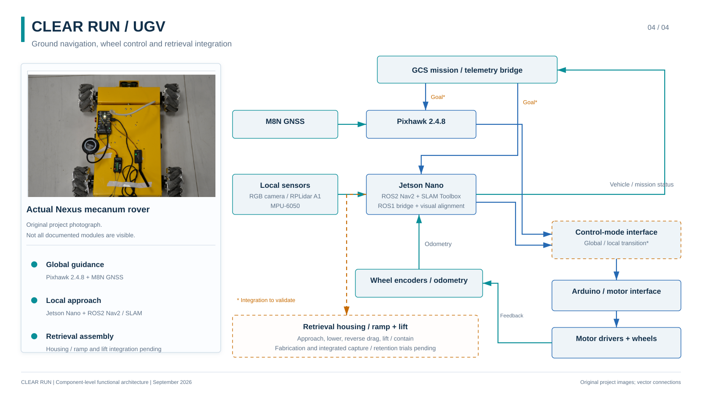
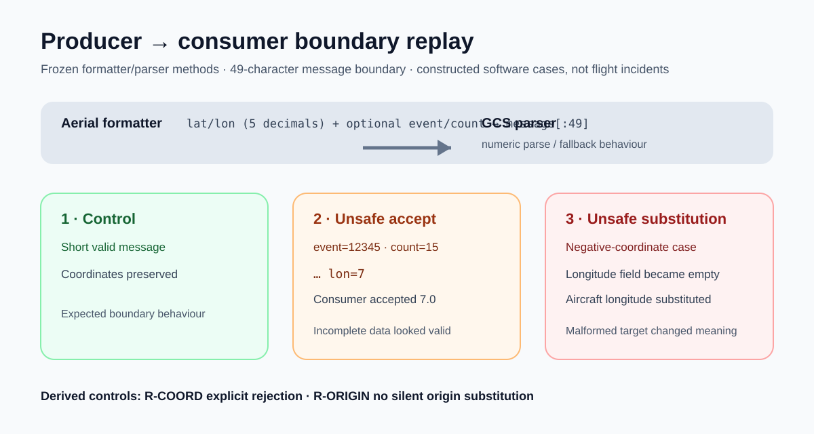

# AI Systems Assurance & Evidence-Linked MBSE — Clear Run

*Selected Clear Run Research Outreach architecture: actual UAV photograph, native GCS interface capture and actual UGV photograph embedded in the reviewed functional system view.*

This is the assurance layer around a real AI/autonomy programme. Clear Run can only claim mission success if **detection, geolocation, communications, operator review, ground-vehicle tasking, terminal approach, physical capture and retained removal** each work at the correct system boundary and in the correct configuration. The case therefore links architecture, interfaces, requirements and evidence instead of letting a successful model output stand in for system verification.

A retrospective **Capella 7.1.0 / Arcadia** reconstruction was built in September 2026 to make those dependencies explicit. It then went beyond documentation: a bounded producer-consumer replay of the telemetry path exposed a concrete truncation behavior that could turn a coordinate message into a plausible but wrong downstream value, and that observation was converted into explicit rejection/coordinate-origin requirements. The public case exposes that engineering logic without publishing restricted programme material.

## Physical system context

  
  

  

These are the selected **1600 × 900 Research Outreach architecture compositions**. Their text and connectors remain vector-based while the project photographs/interface capture are embedded from the real Clear Run evidence set. The aerial unit, GCS and ground unit are therefore shown as the system that actually exists, not replaced by illustrative hardware icons.

## Maintained modelling scope

| Scope | Evidence-backed state |
|---|---|
| Logical architecture | **3 mission components · 14 allocated logical functions · 13 logical functional exchanges** |
| Physical architecture | bounded producer-consumer software realization for the inspected telemetry path |
| Requirements | explicit interface requirements linked to source methods and model elements |
| Evidence applicability | boundary · configuration · trace · acceptance checks |
| Native validation | retained model validation with **0 errors**; warnings disclose intentionally incomplete physical/EPBS realization rather than being hidden |

The model does **not** prove localisation accuracy, successful retrieval, a complete Arcadia lifecycle, or operational certification.

## From a visible success to a system-level claim

A target appearing correctly on a GCS is not proof that the transmitted value is correct. A dispatch button changing state is not proof that a rover accepted a task. Contact with debris is not proof that it was retained after movement.

The assurance model therefore asks four questions before evidence is allowed to support a system claim:

1. **Boundary** — was the outcome observed at the boundary that actually owns the claim?
2. **Configuration** — do model/engine, calibration, hardware, software and operating mode match?
3. **Trace** — is the evidence connected to the responsible function, exchange, requirement and downstream consumer?
4. **Acceptance** — is there a declared pass/fail rule and an actual recorded result?

## Producer-consumer replay

A bounded replay isolated the inspected formatter and parser methods from the frozen programme baseline. It did **not** invoke radios, ROS, rover connections or a flight mission.

The formatter emitted latitude/longitude text with optional metadata and returned only the first **49 characters**. Three constructed cases exposed materially different outcomes:

- a short control message preserved the intended coordinates;
- adding event identifier **12345** and count **15** truncated the longitude field after `lon=7`, which the consumer accepted as numeric **7.0**;
- a negative-coordinate case truncated the longitude to an empty field, after which the consumer substituted the aircraft longitude supplied by the test fixture.

These are **constructed software boundary cases, not observed flight incidents**. Their value is that they convert a plausible interface concern into reproducible acceptance criteria.

The public machine-readable record is in [`evidence/mbse/telemetry_replay_cases.json`](../../evidence/autonomy_edge_ai/mbse/telemetry_replay_cases.json).

## Requirements derived from the failure mode

**R-COORD** — for every valid, complete target message within the declared input envelope, the GCS shall recover the supplied coordinates at the declared encoding precision. Invalid, incomplete or unsupported messages shall be explicitly rejected.

**R-ORIGIN** — target coordinates shall not silently substitute aircraft position when target data are absent or malformed.

The distinction matters: **encoding precision is not localisation accuracy**. Printing five decimal places does not prove that a physical target estimate is accurate enough for terminal approach or pickup.

## Why this belongs in an AI portfolio

This work demonstrates the engineering around AI that model metrics alone do not cover:

- evidence-linked architecture rather than decorative system diagrams;
- explicit producer-consumer responsibility;
- configuration-aware V&V;
- boundary-specific acceptance criteria;
- fault-oriented replay and regression thinking;
- separation of intermediate subsystem success from mission completion.

That assurance discipline is carried into the public [Clear Run mission-verification matrix](../../evidence/autonomy_edge_ai/clear_run/mission_verification_matrix.json).

## Publication status

The practitioner case **“From debris detection to verified removal: Evidence-linked MBSE for an evolving airfield robotics system”** was submitted to **INCOSE Applications & Case Studies (IACS) on 16 September 2026**. Editorial acknowledgement/review remains pending; submission is not represented as acceptance or publication.

[Back to portfolio](../../README.md) · [Clear Run / TIR-FOD case study](clear-run-tir-fod.md) · [Technical evidence](../../evidence/README.md)
