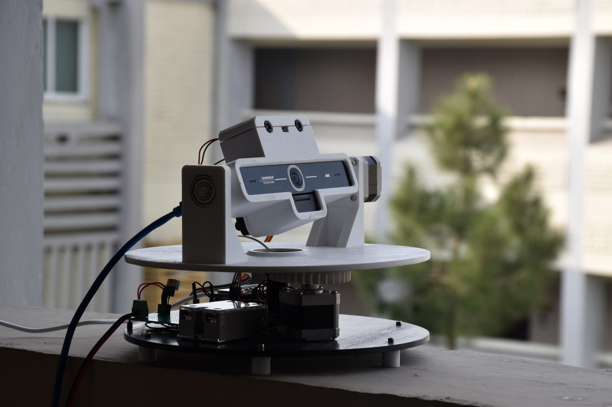
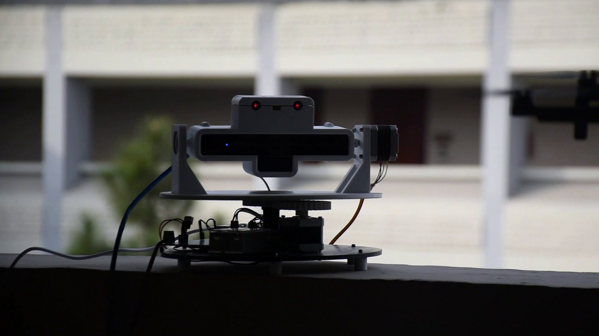
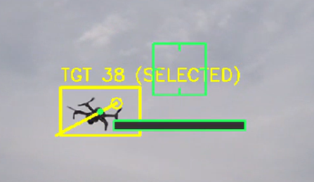
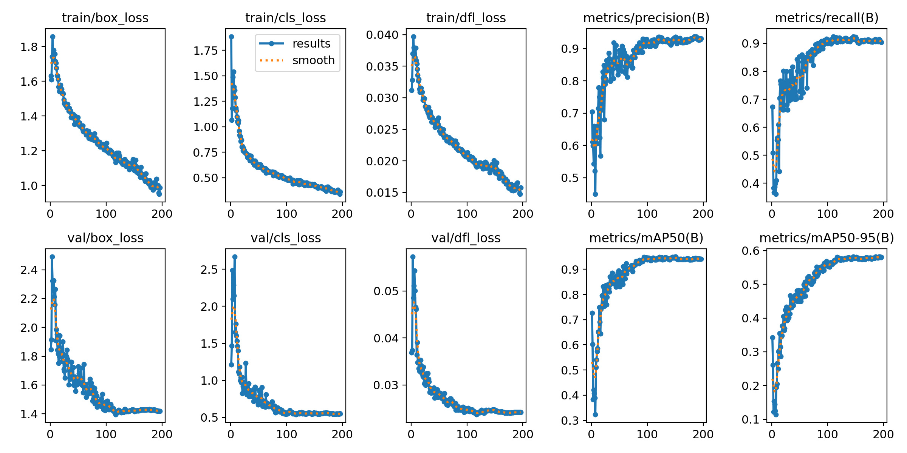
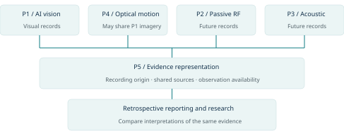

# Counter-UAS Phase I — physical AI-vision prototype and multisensor research foundation

**Historical technical repository:** private · [Request technical review access →](https://github.com/razaumair2203-ux/applied-ai-portfolio/issues/new?template=access-counter-uas.yml)

Phase I is a completed **physical drone-detection research prototype**, led by M. Umair Raza as **Principal Investigator**. The work progressed from dataset/model development into a constructed laser–camera sensing mount and preliminary indoor/outdoor trials, using approximately **14,000 training images**, a **1,500-image test set**, **200 training epochs** and 640×640 inputs. Later passive-RF, acoustic and multisensor work remains a separate research direction rather than being back-claimed as completed capability.

## Physical system evidence

  
  

*Authentic Phase-I hardware. Left: the constructed laser–camera mount extracted byte-identically from the original project presentation before publication resizing. Right: the same mount shown in the original project video at 00:34.*

The public images are presentation derivatives only: EXIF orientation correction, proportional resize, JPEG compression and conservative contrast/sharpness adjustment. **No hardware, people, background or scene content was added, removed or regenerated.** The source and output SHA-256 records are published in [hardware provenance](../../evidence/autonomy_edge_ai/counter_uas/hardware_provenance.json).

## Demonstrated detection work

  
  

The archived project evidence includes:

- computer-vision drone detection in a physical sensing setup;
- indoor and outdoor experimental trials;
- camera / hardware integration records;
- preserved model-training results and trial imagery;
- original source material catalogued with provenance and hashes.

## Engineering scope

The engineering value is the **prototype-to-experiment transition**: model development, physical sensing hardware, camera/mount integration, manual/automatic operating modes and real indoor/outdoor trial conditions were brought together under one Phase-I programme. It is not represented as an operational counter-drone weapon or fielded C-UAS product.

## Contribution boundary

- **Direct responsibility:** Principal Investigator / research direction, experiment framing and systems-integration oversight.
- **Team-developed work:** model development, prototype construction and trial execution are represented as programme outputs rather than sole-authorship claims.
- **Scope boundary:** Phase-I visual detection evidence is separated from later passive-RF, acoustic and multisensor research directions.

## Evidence provenance and programme evolution

The private source archive retains the full-resolution original mount photograph, the original Phase-I trial video and the historical presentation/poster material. The public portfolio now carries publication-sized derivatives of the hardware photograph and video frame alongside the original-size-derived detection outputs and training curves.

*Phase I / AI vision is completed evidence. Later RF/acoustic/multisensor stages are research directions, not represented as completed capability.*

## Research evolution

Follow-on work investigates how independently recorded optical, passive-RF and acoustic modalities could be compared and eventually fused while retaining provenance. Those directions are not represented as completed Phase-I capability.

The detailed historical source repository remains private because it contains programme material and original project records.

[Back to domain index](README.md)
