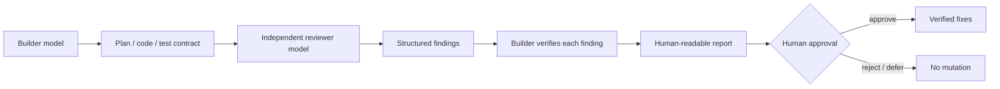

# Adversarial Review Lite — cross-model assurance for AI-written software

**Public tools:** [Codex Adversarial Review Lite](https://github.com/razaumair2203-ux/codex-adversarial-review-lite) · [Claude Adversarial Review Lite](https://github.com/razaumair2203-ux/claude-adversarial-review-lite)

The two public repositories turn an informal “ask another model to look at it” habit into a **repeatable software-assurance workflow** for people building real applications with coding agents. They support both directions—**Claude builds → Codex reviews** and **Codex builds → Claude reviews**—while keeping mutation and release authority with the human.

The system freezes review scope, carries relevant tests/fixtures/rubrics into the review contract, snapshots repository state, dispatches an independent reviewer, validates reviewer output, re-checks each finding instead of obeying it blindly, and presents a report **before** any fix is allowed. It is aimed at changes where hallucinated APIs, weak tests, auth/billing mistakes, migrations or multi-file scope drift can create real engineering cost.

*Original report preview from the public Codex Adversarial Review Lite project.*

## Control flow

## Engineering controls

- separate builder/reviewer roles;
- Windows/macOS/Linux/WSL execution support;
- environment/self-test before review;
- reviewer-model fallback;
- frozen review scope;
- test-spec, fixture and optional rubric inputs;
- file-hash / mutation checks;
- structured reviewer output and quality classification;
- human-review floor for higher-consequence changes;
- strict mode for rubric-driven review;
- report-before-fix workflow and explicit approval before mutation.

The design does not treat a second model as proof of correctness. It creates an independent failure surface and forces findings back through verification and human authority.

The public repository includes the report template, sample artifact, cross-platform installer/self-test and operating rules for the builder/reviewer workflow.

## Engineering scope

The project demonstrates model orchestration, fallback logic, runtime/tool checks, structured outputs, mutation controls, evaluation discipline and human-in-the-loop release authority.

[Back to domain index](README.md)
