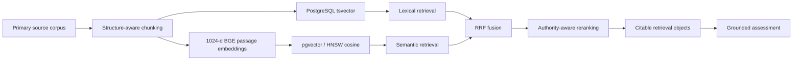

# Lodestar — Inspectable RAG Engineering Evidence

This folder is a sanitized public evidence bundle extracted from the working private **Lodestar** codebase. It exists so a technical reviewer can inspect representative implementation details instead of relying on a résumé claim that says “RAG”.

## Current verified state

| Evidence | State |
|---|---:|
| Real legal corpus | **209 documents** |
| Retrieval units | **2,945 chunks, all embedded** |
| Grounding evaluation | **34 hand-checked query / expected-citation pairs** |
| Top-5 grounding error | **2.9%** |
| Python/backend automated tests | **53 green** |
| Stress / abuse cases | **17 / 17 pass** |
| Browser E2E | **3 / 3 Playwright flows pass** |
| Concurrent full-flow stress | **12 / 12 pass** |

## Retrieval architecture

## Representative implementation files

- [`legal_chunking.py`](legal_chunking.py) — deterministic legal-structure-aware chunking.
- [`embedding_provider.py`](embedding_provider.py) — provider contract, BGE query/passage asymmetry, dimensionality validation, lazy loading.
- [`hybrid_retrieval.py`](hybrid_retrieval.py) — lexical + vector retrieval, RRF fusion, authority lanes, reranking and citable evidence hydration.
- [`chunks_schema.sql`](chunks_schema.sql) — PostgreSQL retrieval plane with `pgvector`, HNSW cosine ANN, FTS and metadata indexes.
- [`grounding-eval.md`](grounding-eval.md) — measured retrieval-grounding result.

## Architecture decisions

- legal structure before size-based chunk splitting;
- hybrid lexical + vector retrieval because each catches different failure modes;
- Reciprocal Rank Fusion instead of pretending cosine and lexical rank scores are directly comparable;
- high-authority candidate lanes before reranking;
- embedding model/version/dimension stamped as provenance;
- vector index treated as a rebuildable cache, not source truth;
- retrieval evaluation separated from LLM answer-quality evaluation;
- lexical fallback instead of hard failure when embeddings are unavailable.

The full application remains private because it contains product internals and candidate-data structures. This bundle contains selected non-secret implementation evidence only.

[Back to Lodestar case study](../../projects/lodestar.md) · [Back to portfolio](../../README.md)
