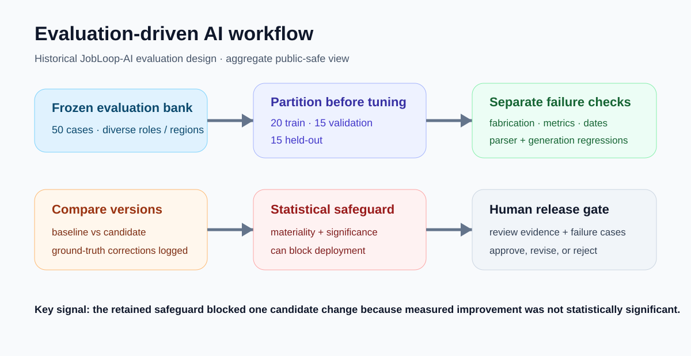

# Evaluation-Driven AI Workflow Engineering



This case captures a part of the private JobLoop-AI development record that is easy to miss in a product screenshot: **AI behaviour was treated as something to measure, regress and gate rather than something to judge from a few good-looking outputs.**

The public portfolio exposes only aggregate, non-personal evidence. Pair-level prompts, CVs, job descriptions and private career data remain outside this repository.

## Historical evaluation design

A retained May 2026 pilot used **50 frozen evaluation pairs** split before tuning:

| Partition | Cases |
|---|---:|
| Train | **20** |
| Validation | **15** |
| Held-out | **15** |

The bank intentionally covered **9 persona categories, 40 industries, 8 regions and 5 job-description styles**. Those counts describe test diversity; they are not user counts or production traffic.

The evaluation separated failure modes rather than collapsing them into one subjective score. The retained sensitivity checks recorded:

- fabrication detection: **1.00**;
- date-error detection: **1.00**;
- metric-preservation detection: **0.92**.

These values belong to the original harness definitions and frozen cases. They are historical test-harness results, not general claims that the system is “100% accurate.”

## Baseline and parser regression

One 20-pair structural comparison recorded a **0.60 baseline pass rate** against a **1.00 reference ceiling** for the frozen harness. This is useful because it shows that apparently plausible generation was not automatically counted as acceptable; multiple structural and factual checks had to pass.

A later JD-parser rescore covered **38 cases** after scoring improvements and ground-truth corrections. The aggregate score distribution recorded a **0.860 mean** and **0.883 median**, with the weakest case materially below the strongest. The point is the spread and retained failure surface, not the absolute number.

The public aggregate is [machine-readable](../evidence/ai-evaluation/evaluation_summary.json).

## A safeguard that said “do not deploy”

The strongest engineering signal is a negative result.

A retained prompt-optimization safeguard marked the candidate **BLOCKED** because the measured improvement was not statistically significant and did not clear the configured materiality threshold. The workflow required human review rather than turning “newer prompt” into “better prompt.”

That is the behaviour I want in AI engineering:

```text
candidate change
  -> frozen regression cases
  -> held-out comparison
  -> failure-mode checks
  -> materiality / significance gate
  -> human review
  -> release or reject
```

## What this demonstrates

- train/validation/held-out separation for AI workflow changes;
- explicit ground-truth correction rather than silently changing the benchmark;
- separate detection of fabrication, date and metric errors;
- versioned prompt/evaluation artefacts;
- regression and parser rescoring;
- statistical and materiality gates;
- human release authority.

## Boundary

These are **historical engineering evaluation snapshots from May 2026**, not live product metrics, hiring-outcome predictions, ATS scores or claims about all possible inputs. They demonstrate the evaluation discipline used around an AI-assisted system.

[Back to portfolio](../README.md) · [JobLooper case](joblooper-jobpilot.md) · [Aggregate evidence](../evidence/ai-evaluation/evaluation_summary.json)
