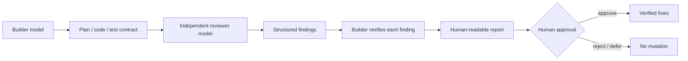
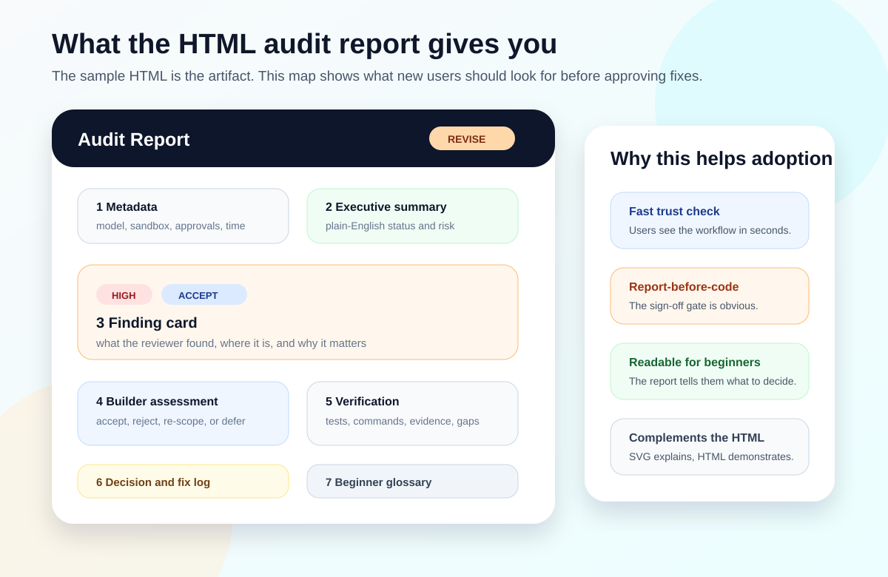

# Codex Adversarial Review Lite — independent AI code review

**Public tools:** [Codex Adversarial Review Lite](https://github.com/razaumair2203-ux/codex-adversarial-review-lite) · [Claude Adversarial Review Lite](https://github.com/razaumair2203-ux/claude-adversarial-review-lite)

The two repositories are companion directions of the same assurance pattern: **Claude builds → Codex reviews** or **Codex builds → Claude reviews**, with human authority retained in both directions.

AI coding agents can preserve their own blind spots during self-review. The toolchain inserts an independent reviewer model into the workflow, then requires each finding to be re-validated before any change is accepted.

*Original report preview from the public Codex Adversarial Review Lite project.*

## Control flow

## Engineering controls

- separate builder/reviewer roles;
- Windows/macOS/Linux/WSL execution support;
- environment/self-test before review;
- reviewer-model fallback;
- frozen review scope;
- test-spec, fixture and optional rubric inputs;
- file-hash / mutation checks;
- structured reviewer output and quality classification;
- human-review floor for higher-consequence changes;
- strict mode for rubric-driven review;
- report-before-fix workflow and explicit approval before mutation.

The design does not treat a second model as proof of correctness. It creates an independent failure surface and forces findings back through verification and human authority.

The public repository includes the report template, sample artifact, cross-platform installer/self-test and operating rules for the builder/reviewer workflow.

## Engineering scope

The project demonstrates model orchestration, fallback logic, runtime/tool checks, structured outputs, mutation controls, evaluation discipline and human-in-the-loop release authority.

[Back to project inventory](README.md)
