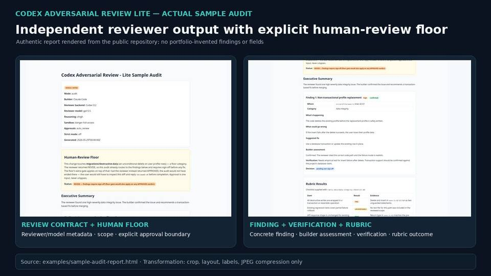
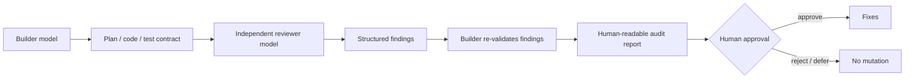

# Codex Adversarial Review Lite — independent AI code review

*Rendered from the public repository's actual `examples/sample-audit-report.html`: reviewer/runtime metadata, human-review floor, concrete finding, verification, rubric result and decision record. No report fields or findings were invented for the portfolio.*

**Public repository:** [codex-adversarial-review-lite](https://github.com/razaumair2203-ux/codex-adversarial-review-lite)

## Problem

AI coding agents can reproduce their own blind spots during self-review. This project inserts an independent reviewer model into the workflow and treats findings as claims to verify, not instructions to obey.

## Working control flow

## Engineering controls in the public implementation

- separate builder/reviewer roles;
- platform-aware Windows/macOS/Linux/WSL execution;
- reviewer-model fallback;
- environment/self-test before audit;
- frozen audit scope;
- test-spec and fixture inputs;
- file-hash / mutation checks;
- structured reviewer output and quality classification;
- explicit report-before-fix workflow;
- human approval before code mutation;
- privacy and local-execution boundaries;
- strict mode and rubric-driven review for higher-consequence work.

The project is intentionally not marketed as “AI guarantees correctness.” Its purpose is to add an independent failure surface and force explicit review discipline.

## Why it belongs in this portfolio

It demonstrates hands-on GenAI product engineering beyond prompting: model orchestration, fallback logic, tool/runtime checks, structured outputs, safety boundaries, evaluation discipline and human-in-the-loop control.

[Back to portfolio](../README.md)
