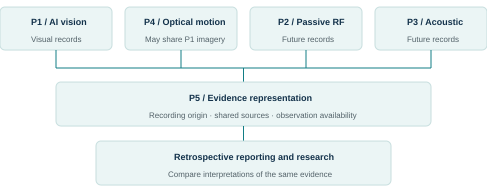

# Counter-UAS applied AI research

This is a public-safe summary of a private research archive. It separates **completed Phase I evidence** from future multimodal research so proposed capability is not presented as demonstrated capability.

## Completed Phase I

- computer-vision drone-detection demonstrator;
- indoor and outdoor detection trials;
- preserved training curves and original visual records;
- hardware / camera-mount evidence;
- retrospective evidence catalogue with checksums and provenance.

## Research evolution

The broader research framework studies how independently recorded sensing modalities could be compared and fused without erasing provenance. Planned directions include optical motion, passive RF and acoustic evidence, but those remain separate maturity states rather than being represented as completed sensors.

## Engineering emphasis

- computer vision in a real sensing setup;
- dataset / experiment provenance;
- evidence cataloguing and reproducibility;
- system-level research architecture;
- explicit separation of demonstrated capability from proposed work;
- transition from isolated model performance to multi-sensor / operational research questions.

The detailed source repository remains private because it contains historical programme material and original project evidence. This portfolio exposes only the public-safe engineering layer.

[Back to portfolio](../README.md)
