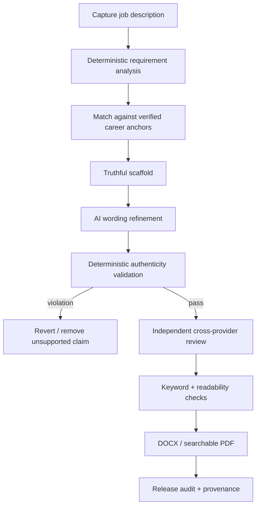

# JobLooper / JobPilot — governed AI product engineering

**Public implementation:** [Pub-JobLooper](https://github.com/razaumair2203-ux/Pub-JobLooper)  
**Private product:** JobPilot Local (private because test fixtures contain real personal career data)

## Product problem

Most AI résumé/application tools optimize for fluent text. These systems instead optimize for **traceability and controlled generation**: every material claim should map to verified evidence, unsupported claims should fail closed, and AI-generated output should pass deterministic checks before release.

## JobPilot pipeline

## Engineering features

- local-first architecture;
- structured career knowledge base / claim anchors;
- provenance-preserving IDs;
- deterministic checks for dates, metrics, ownership verbs and unsupported facts;
- fail-closed behavior when evidence is missing;
- separate AI-provider adapters;
- Claude/Codex cross-provider review;
- browser extension + loopback companion architecture;
- DOCX/PDF generation;
- release-gate protocol and audit log;
- TypeScript/Node implementation;
- automated test, typecheck and real-browser QA paths.

## Why this is relevant to AI development

This is an example of **AI inside a deterministic product**, rather than AI replacing product logic. The model is deliberately constrained to a narrow layer; evidence storage, validation, release decisions, rendering and auditability remain conventional software responsibilities.

That design pattern is directly applicable to enterprise AI: keep the model useful, but do not make it the sole authority for correctness, permissions or release state.

[Back to portfolio](../README.md)
