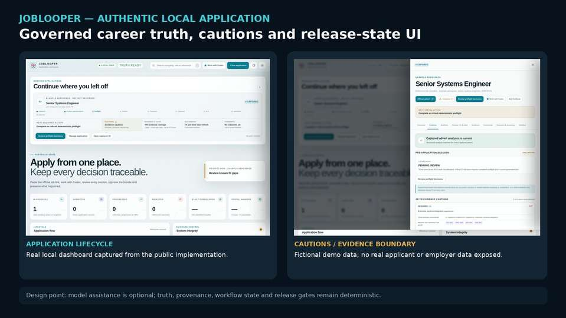

# JobLooper — deterministic assurance around AI-assisted document generation

**Public implementation:** [Pub-JobLooper](https://github.com/razaumair2203-ux/Pub-JobLooper)



*Authentic dashboard rendered from the public application using fictional demo data. The interface itself is real; no applicant or employer claim in the screenshot is presented as career evidence.*

JobLooper is useful evidence here because it demonstrates a design principle for applied AI: the model may help with interpretation or drafting, but **truth, provenance, workflow state and release gates remain deterministic software responsibilities**.

## What the public implementation actually is

The public application is a local-first **Python 3.10+** system built primarily on the standard library. It can operate without an AI provider and adds optional assistant integration rather than making the model a hard runtime dependency.

Its implemented workflow includes:

- exact job-description capture;
- preflight / requirement checks;
- structured evidence and career-anchor handling;
- deterministic generation and release gates;
- provenance and content hashes;
- stateful application records;
- local dashboard and CLI paths;
- document build / export controls;
- submission-state tracking;
- optional Codex/OpenAI App Server assistance.

## Why the architecture is relevant to AI systems

A common failure mode in AI-assisted generation is allowing fluent output to overwrite factual or workflow state. JobLooper instead keeps the model inside a bounded layer:

```text
source evidence + captured requirement
              ↓
deterministic application state
              ↓
optional AI assistance
              ↓
deterministic validation / release gates
              ↓
document build + hashes + submission record
```

The public repository therefore demonstrates **AI containment and assurance**, not a claim that every stage is AI-powered.

## Assurance boundary

JobLooper deliberately keeps hiring predictions, ATS-score claims and unverified model output outside its authority model. Dates, metrics, ownership, workflow state and release decisions remain bound to approved evidence and deterministic checks. A related private experimental system, JobPilot Local, explores additional workflows, while this portfolio uses the public implementation as the evidence source.

[Back to portfolio](../README.md)
