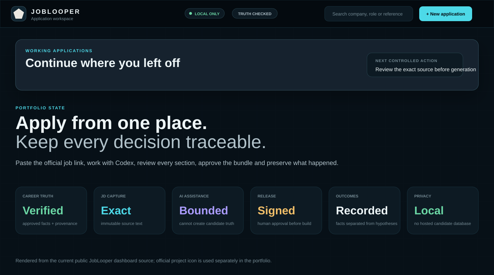
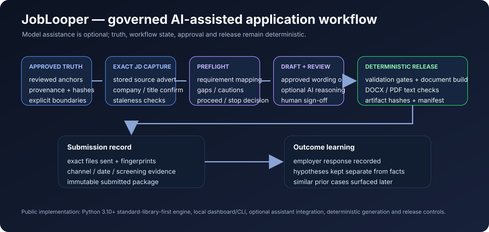

# JobLooper — deterministic controls around AI-assisted document generation

**Public implementation:** [Pub-JobLooper](https://github.com/razaumair2203-ux/Pub-JobLooper)

JobLooper applies a simple design principle: a model may assist with interpretation or drafting, while **truth, provenance, workflow state and release authority remain deterministic software responsibilities**.

  

*The official project mark comes from the public JobLooper project; the dashboard surface is rendered from the current public dashboard source.*

## Governed workflow

## Public implementation

The application is a local-first **Python 3.10+** system built primarily on the standard library. It can operate without an AI provider and adds optional assistant integration rather than making a model a hard runtime dependency.

Implemented workflow elements include:

- reviewed career truth represented as approved anchors with provenance;
- exact job-description capture rather than an inferred summary;
- deterministic requirement/preflight state;
- optional AI assistance inside the workflow rather than as generation authority;
- complete document review and user sign-off before build;
- deterministic DOCX/PDF generation and validation gates;
- provenance, content hashes and generation fingerprints;
- exact submission records and outcome tracking;
- stale-input detection when truth, JD, code or feedback changes.

## Evaluation programme

The wider private development record also includes a historical evaluation harness with frozen train/validation/held-out cases, explicit fabrication/date/metric checks, parser rescoring, prompt-version comparison and release safeguards. A public-safe aggregate is documented in **[Evaluation-Driven AI Workflow Engineering](ai-evaluation-workflows.md)**.

The important point is not a single score: one retained candidate optimization was **blocked** because the measured improvement was not statistically significant, preserving human release authority instead of assuming a newer prompt was better.

## AI-system relevance

The technical point is **model containment**. AI can reason over an application, but it cannot silently rewrite truth, convert a hypothesis into fact, release a document, or change submission state. Those transitions are explicit software state changes.

Hiring predictions, ATS-score claims and unverified model output remain outside the authority model.

[Back to project inventory](README.md)
