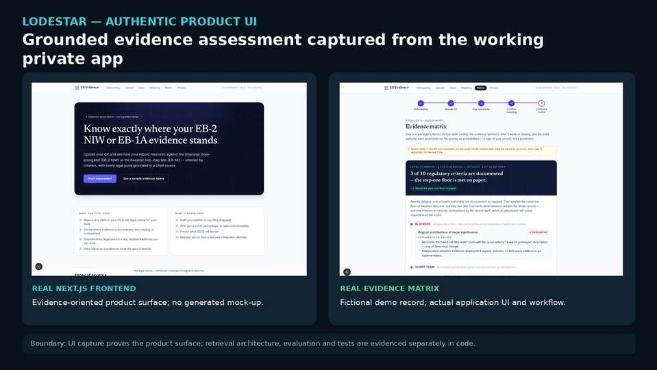

# Lodestar — grounded RAG and evidence assessment

**Working private full-stack RAG system with public sanitized implementation, a runnable pure-logic smoke check, and a public evaluation specification.**

## At a glance

| Dimension | Evidence |
|---|---|
| **Problem** | Evidence assessment where retrieval quality, source authority and citation traceability matter more than fluent generation |
| **Backend** | Python · FastAPI · PostgreSQL · `pgvector` |
| **Retrieval** | BGE embeddings · HNSW semantic search · PostgreSQL FTS · four retrieval lanes · Reciprocal Rank Fusion |
| **Grounding** | Citable evidence objects · source metadata · deterministic authority-weighted reranking |
| **LLM integration** | Provider-swappable generation downstream of retrieval/evidence logic |
| **Measured state** | **209 documents · 2,945 chunks · 34 hand-checked retrieval queries · 2.9% top-5 retrieval-grounding error** |
| **Software assurance** | **53 backend tests · 17/17 stress/abuse cases · 3/3 Playwright flows · 12/12 concurrent full flows** |



*Authentic Next.js application render captured from the working private repository. The UI proves the implemented product surface; retrieval architecture, evaluation and reliability claims remain independently inspectable in the public code/evidence bundle.*

## My contribution and development model

I defined the product constraints, stack, retrieval/grounding requirements and acceptance criteria, then drove iterative implementation, testing and hardening through an **AI-assisted coding workflow**. The portfolio claim is engineering ownership of the architecture, evaluation gates and working system—not that every source line was manually typed without coding-agent assistance.

That distinction matters for this project: the design deliberately keeps model generation downstream of deterministic retrieval, citation resolution, evidence state and release constraints, so AI assistance in development does not become authority inside the product.

## Why this project matters for GenAI / RAG roles

Lodestar is designed around the engineering failure modes that matter in RAG systems: poor chunking, weak retrieval, inconsistent score spaces, unsupported citations, model/provider coupling and the tendency for fluent generation to conceal evidence failures.

The LLM is therefore intentionally downstream of a retrieval and evidence plane.

```text
legal / policy corpus
        ↓
structure-aware chunking
        ├── BGE passage embeddings ──> pgvector / HNSW ───┐
        └── PostgreSQL full text ─────> lexical retrieval ┤
                                                         ↓
                                      Reciprocal Rank Fusion
                                                         ↓
                                      authority-aware reranking
                                                         ↓
                                      citable evidence objects
                                                         ↓
                                      grounded assessment / LLM
```

## Retrieval architecture

The implemented system includes:

- legal-structure-aware ingestion and chunking;
- BGE query/passage embeddings with model and dimensionality checks;
- PostgreSQL `pgvector` HNSW cosine search;
- PostgreSQL full-text lexical search;
- separate high-authority candidate lanes;
- Reciprocal Rank Fusion rather than mixing incomparable lexical/vector score scales directly;
- deterministic authority-weighted reranking;
- citable retrieval objects carrying source/citation metadata;
- evidence parsing and assessment logic;
- provider-swappable LLM integration;
- Next.js frontend and FastAPI backend.

Authority is applied as a bounded multiplier on the fused retrieval score; it can favor stronger sources in close rankings without replacing relevance as the primary signal.

## Evaluation

The hand-checked grounding set currently contains **34 query / expected-source pairs**. The evaluation asks whether an accepted authority/citation marker appears in the top five retrieved results.

**Recorded full-system result: 2.9% top-5 retrieval-grounding error** on the private **209-document / 2,945-chunk** corpus. The public portfolio includes the frozen 34-pair evaluation set and evaluation code; it does not publish the complete corpus/database, so this exact full-system result is not presented as independently reproducible from the portfolio alone.

This metric is intentionally separated from answer-generation quality so fluent text cannot hide a retrieval miss.

## Engineering trade-offs, failures and current limits

- **Vector and lexical scores are not directly comparable.** Reciprocal Rank Fusion combines rank positions rather than inventing a shared numeric scale for cosine distance and PostgreSQL text relevance.
- **Authority must enter before generation.** In a decision-heavy corpus, non-precedent decisions can crowd the controlling statute/regulation/precedent out of the candidate pool. Separate high-authority retrieval lanes ensure those sources can compete in fusion; the subsequent authority multiplier remains deliberately small so a clear relevance advantage still wins.
- **The 34-query set is a targeted regression/evidence-retrieval check, not a universal RAG benchmark.** It measures whether an accepted source appears in the top five; it does not by itself establish answer correctness, legal correctness or user-outcome quality.
- **The exact 2.9% result depends on the private corpus and database state.** Public files expose the frozen pair set, evaluation logic and runnable pure-logic checks, but not the complete corpus.
- **Generation is intentionally downstream.** A fluent LLM response cannot substitute for source retrieval. Deeper answer-level evaluation, observability and security hardening remain active engineering work.

## Reliability and operationalization

The working code also includes practical software/runtime engineering:

- pooled PostgreSQL connections and batched evidence inserts;
- explicit `pgvector` casting on ANN queries;
- UUID validation before SQL execution;
- lazy embedding-model loading, warm-up and guarded initialization;
- lexical fallback while embeddings are unavailable;
- citation-resolution checks before evidence reaches downstream assessment;
- audit logging and candidate-data deletion paths;
- authentication scaffolding;
- backend, DB integration, browser, stress/abuse and concurrency testing.

## Inspectable implementation evidence

A technical reviewer can inspect representative sanitized implementation directly:

- [`legal_chunking.py`](../evidence/lodestar/legal_chunking.py) — structure-aware chunking;
- [`embedding_provider.py`](../evidence/lodestar/embedding_provider.py) — embedding-provider contract and BGE behavior;
- [`hybrid_retrieval.py`](../evidence/lodestar/hybrid_retrieval.py) — hybrid retrieval, candidate lanes, RRF and evidence hydration;
- [`rerank.py`](../evidence/lodestar/rerank.py) — deterministic authority-sensitive reranking;
- [`chunks_schema.sql`](../evidence/lodestar/chunks_schema.sql) — PostgreSQL schema, FTS and HNSW vector index;
- [`grounding_pairs.json`](../evidence/lodestar/grounding_pairs.json) — hand-checked evaluation set;
- [`grounding_eval.py`](../evidence/lodestar/grounding_eval.py) — retrieval-grounding evaluation;
- [`retrieval_integration_test.py`](../evidence/lodestar/retrieval_integration_test.py) — database-backed retrieval test;
- [`grounding-eval.md`](../evidence/lodestar/grounding-eval.md) — recorded full-system evaluation result.
- [`public_smoke_test.py`](../evidence/lodestar/public_smoke_test.py) — zero-dependency public checks for retrieval-control logic and the frozen evaluation specification.

## Current engineering direction

The next evolution is deeper downstream answer evaluation, automated regression gating, observability and security hardening around an already working retrieval/application system.

[Back to portfolio](../README.md) · [Technical evidence index](../evidence/README.md) · [Lodestar evidence bundle](../evidence/lodestar/README.md)
