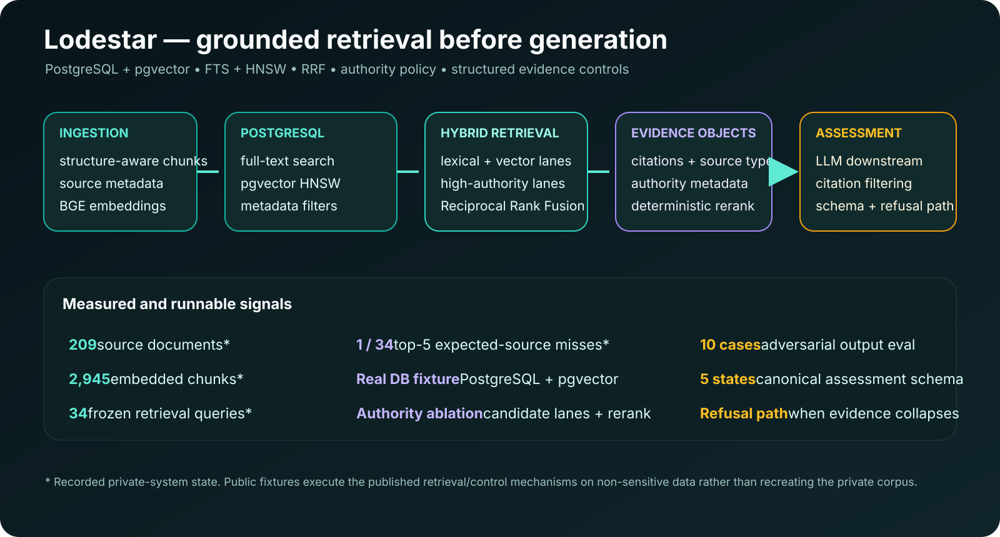
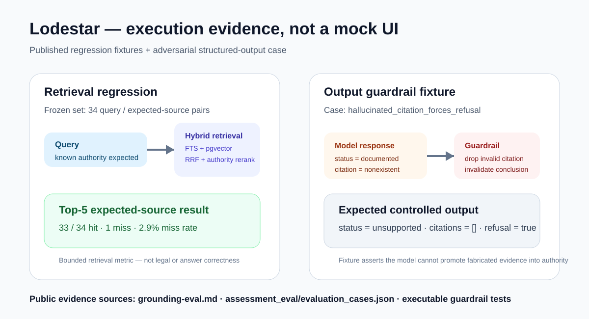

# Lodestar — grounded RAG and structured evidence assessment


*Source-derived rendering of the current Lodestar frontend landing page. The private project defines the interface but has no separate distributable logo asset.*

Lodestar is a working full-stack RAG system designed for source-sensitive evidence retrieval and structured assessment. Retrieval quality, source authority and output constraints are explicit system concerns rather than implicit prompts.

## At a glance

| Dimension | Current implementation |
|---|---|
| Backend | Python · FastAPI · PostgreSQL |
| Embeddings | sentence-transformers / BGE with explicit query/passage behaviour |
| Retrieval | PostgreSQL FTS + pgvector HNSW · lexical/vector candidate lanes · Reciprocal Rank Fusion |
| Source policy | high-authority candidate lanes + deterministic reranking |
| Output layer | citable evidence objects, citation filtering, five-state assessment schema, refusal path |
| Recorded private-system state | **209 documents · 2,945 chunks · 34 frozen retrieval queries · 1/34 top-5 expected-source misses (2.9%)** |
| Public execution | pure-logic tests, **11-invariant reliability regression**, PostgreSQL/pgvector fixture, authority ablation, adversarial structured-output evaluation |

## Retrieval architecture



The retrieval path uses structure-aware chunking, local embeddings, PostgreSQL full-text search and vector search in parallel. Ordinary lexical/vector lanes are supplemented by high-authority lanes so controlling sources remain represented in the candidate pool. Results are fused with **Reciprocal Rank Fusion**, hydrated into citable evidence objects and passed through a deterministic authority-sensitive reranker.

This avoids inventing one numeric scale for lexical relevance and vector distance.

## Execution / evaluation trace



The execution visual is derived from the published regression record and adversarial output fixtures: the frozen retrieval set records **1 miss in 34 top-5 expected-source queries**, and the `hallucinated_citation_forces_refusal` fixture asserts that a model response claiming `documented` with a nonexistent citation is reduced to **unsupported + no citations + refusal**.

[Grounding evaluation](../evidence/lodestar/grounding-eval.md) · [Adversarial output cases](../evidence/lodestar/assessment_eval/evaluation_cases.json)

## Evaluation

The frozen retrieval set contains **34 query / expected-source pairs** and asks a bounded question: whether an accepted authority/citation marker appears in the top five results. The recorded private-corpus result is **1 miss in 34 queries (2.9%)**.

The public repository runs a real PostgreSQL + pgvector fixture over the published retrieval code. A separate **11-invariant reliability regression** covers RRF behavior, bounded authority reranking, metadata filters, structure-aware chunking, hallucinated-citation refusal, evidence-ID filtering, canonical output fields and invalid-state rejection. The adversarial structured-output evaluation then exercises those downstream controls over frozen cases: fabricated citations are dropped, unknown evidence IDs are removed, unsupported outputs fall to a refusal path, only the defined five states survive, and unauthorized numeric approval fields are excluded.

Retrieval success and downstream assessment behaviour are measured separately. The public structured-output evaluation is a control test, not a claim of automated legal correctness.

## Run the public checks

```bash
python -m evidence.lodestar.public_smoke_test
python -m evidence.lodestar.reliability_regression
python -m evidence.lodestar.fixture.postgres_fixture_test
python -m evidence.lodestar.fixture.authority_ablation
python -m evidence.lodestar.assessment_eval.run_eval
```

## Published implementation slice

- [structure-aware chunking](../evidence/lodestar/legal_chunking.py)
- [embedding-provider contract](../evidence/lodestar/embedding_provider.py)
- [hybrid retrieval and RRF](../evidence/lodestar/hybrid_retrieval.py)
- [authority-sensitive reranking](../evidence/lodestar/rerank.py)
- [PostgreSQL / pgvector schema](../evidence/lodestar/chunks_schema.sql)
- [retrieval evaluation set](../evidence/lodestar/grounding_pairs.json)
- [retrieval evaluation code](../evidence/lodestar/grounding_eval.py)
- [11-invariant reliability regression](../evidence/lodestar/reliability_regression.py)
- [real-DB integration fixture](../evidence/lodestar/fixture/postgres_fixture_test.py)
- [authority-policy ablation](../evidence/lodestar/fixture/authority_ablation.py)
- [structured-output adversarial evaluation](../evidence/lodestar/assessment_eval/run_eval.py)

The working private system also contains API-contract, assessment-grounding, authentication, candidate-flow, chunking, corpus, gap-answer, parsing, reranking and DB-backed retrieval-integration tests, plus a Playwright browser journey that checks citation presentation and the no-numeric-approval invariant. The public regression above publishes the safe control logic that can be inspected without exposing the private corpus or complete product.

## Engineering trade-offs

- **RRF instead of raw score mixing:** lexical rank and vector distance remain separate until rank fusion.
- **Authority policy is explicit:** higher-authority lanes affect candidate selection before final deterministic reranking.
- **The 34-query set is a regression set, not a universal accuracy measure.**
- **The 2.9% result depends on the private 209-document corpus.** Public fixtures validate the implementation path but do not recreate that corpus.
- **Generation stays downstream.** Fluent model output cannot substitute for missing source retrieval.

## My role

System architecture, retrieval/evaluation design, implementation direction, reliability controls, technical validation and product integration.

[Back to main page](../README.md) · [Implementation bundle](../evidence/lodestar/README.md)
