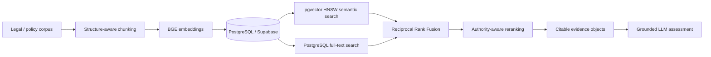

# Lodestar — grounded RAG / evidence assessment

**Status:** active private product; public-safe architecture and evaluation evidence published here.

## Engineering problem

Lodestar evaluates EB-1A / EB-2 NIW evidence against a large legal corpus. The technical problem is retrieval quality and traceability: a fluent LLM answer is useless if the underlying evidence is wrong, weak, or untraceable.

## Working pipeline

## What is implemented

- deterministic, legal-structure-aware chunking rather than blind fixed-size splitting;
- embedding-provider abstraction with model and dimension provenance;
- BGE embedding path for query/document retrieval;
- PostgreSQL/Supabase storage with `pgvector`;
- HNSW cosine index;
- PostgreSQL full-text retrieval;
- semantic and lexical retrieval lanes;
- Reciprocal Rank Fusion;
- authority-aware post-retrieval reranking;
- evidence returned as citable objects instead of disappearing into prompt text;
- FastAPI backend and web application;
- concurrency, browser E2E, stress/abuse and grounding evaluation.

## Measured evidence

| Measure | Current evidence |
|---|---:|
| Corpus | **209 documents** |
| Embedded corpus | **2,945 chunks** |
| Hand-checked retrieval pairs | **34** |
| Retrieval depth | **top-5** |
| Current grounding error | **2.9%** |
| Backend/Python tests | **53 green** |
| Stress / abuse cases | **17 / 17 passed** |
| Browser Playwright E2E | **3 / 3 passed** |
| Concurrent full flows after hardening | **12 / 12 passed** |

The grounding set uses paraphrased queries with known expected authority/citation markers. A retrieval is counted correct when an accepted source appears in the top-5. This is a **retrieval-grounding metric**, not a claim of legal correctness or LLM-answer accuracy.

## Reliability work

The concurrent-flow hardening work included connection pooling, batching, embedder warm-up/locking, UUID validation and lexical fallback. Retrieval evaluation is kept separate from generation so a polished answer cannot mask weak evidence retrieval.

## What I would add next

- larger frozen evaluation set;
- Recall@K, MRR and nDCG;
- latency percentiles per retrieval/reranking stage;
- failure slices by authority type and criterion;
- regression gates on chunker/model/index changes;
- separate grounded-answer evaluation for the downstream LLM.

## Why this is relevant to a Lead AI Developer role

This is hands-on RAG/product engineering: chunking, embeddings, vector databases, semantic search, lexical retrieval, fusion, reranking, APIs, evaluation, production hardening and grounded model integration.

[Back to portfolio](../README.md) · [Representative implementation evidence](../evidence/lodestar/README.md)
