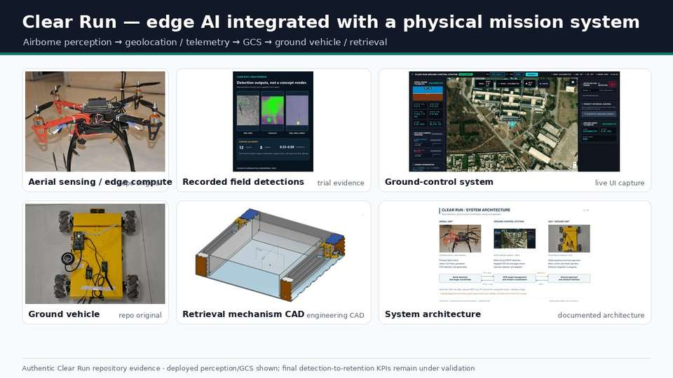
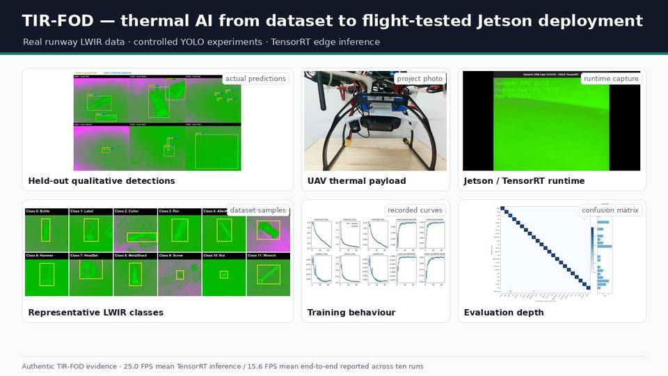

# TIR-FOD / Clear Run — deployed edge AI for runway inspection and autonomy

**One programme, three engineering layers:** model/data development → airborne edge deployment → UAV–GCS–UGV autonomy integration.

## At a glance

| Dimension | Evidence |
|---|---|
| **Problem** | Detect, geolocate and ultimately retrieve runway Foreign Object Debris using unmanned aerial and ground systems |
| **Dataset / benchmark** | **3,499 LWIR source frames · 5,593 annotated objects · 23 classes · 29 completed training runs** |
| **Model work** | YOLOv8 / YOLO11 / YOLO12 comparative experiments + current **multi-model LWIR fusion** |
| **Edge deployment** | Jetson Orin Nano · FP16 TensorRT · UAV flight trials · **25.0 FPS inference / 15.6 FPS end-to-end** |
| **Integrated AI runtime** | Concurrent RGB + passive-IR inference · Ultralytics YOLO + SAHI sliced inference · geolocation · MAVLink/REST · GCS mission integration |
| **Current systems focus** | Closing and quantitatively validating target hand-off, terminal alignment, collection and retention |
| **My role** | Technical direction, systems architecture/interfaces, experiment and evaluation strategy, deployment review, integration gates and team leadership |

**Public dataset:** [TIR-FOD v1.2 — Zenodo DOI 10.5281/zenodo.22546586](https://doi.org/10.5281/zenodo.22546586) · **Reproducible results:** [29-run public recomputation bundle](../evidence/tir-fod/reproducibility/README.md) · **Deployment-code extract:** [Clear Run evidence](../evidence/clear-run/README.md)

**Evidence boundary:** the dataset record, 29-run scalar result set, training/evaluation contract, split evidence and sanitized detector code are public. The public recomputation reproduces the reported seed summaries and paired effects; GPU retraining requires the released dataset and compatible ML environment. Full dual-camera mission source, flight logs and programme integration records remain private/team material. The field throughput, power and thermal figures below remain recorded programme measurements until the separate deployment-log evidence path is published.



*System evidence assembled from repository-original UAV/UGV photographs, recorded field detections, the actual GCS, retrieval-mechanism CAD and documented architecture. No generated imagery or synthetic detections are used.*

## Why this project matters for applied-AI roles

This is not a model-training-only project. The work spans data acquisition, annotation quality, controlled model comparison, leakage/generalisation analysis, reproducible experiment orchestration, model packaging, GPU edge inference, aircraft/UAV integration, telemetry, ground-control interfaces and field validation.

```text
RUNWAY DATA / MODEL ENGINEERING
LWIR acquisition → source-aware dataset → multi-model experiments → evaluation
                                      ↓
EDGE DEPLOYMENT
                           TensorRT / Jetson Orin Nano
                                      ↓
AERIAL MISSION SYSTEM
RGB + IR inference → geolocation → MAVLink/REST → GCS target handling
                                      ↓
GROUND AUTONOMY
                         UGV navigation → terminal retrieval
```

## 1. TIR-FOD — dataset, multi-model AI and controlled evaluation



*Real LWIR detections and class imagery, actual UAV/payload photography, recorded Jetson runtime output, training curves and confusion matrix from the project evidence set.*

The released study contains **3,499 single-shot LWIR source frames**, **5,593 bounding-box annotations** across **23 FOD classes**, a 29,243-image archival pool after offline augmentation, frozen source-lineage-aware partitions and a blind second annotation pass on **338 frames**.

The experimental programme includes **29 completed training runs** across **YOLOv8n, YOLOv8s, YOLOv8m, YOLO11s, YOLO11m and YOLO12s**, plus current multi-model LWIR fusion work.

Key findings include:

- best observed three-seed YOLOv8n mean mAP@[.50:.95]: **0.8603 ± 0.0017**;
- a size-matched contamination experiment increased mAP@[.50:.95] by **8.52 ± 0.19 percentage points**;
- on the shared 12-class experiment, acquisition-block-disjoint evaluation produced **0.7410 ± 0.0423**, compared with **0.8223 ± 0.0070** using frame-level partitioning.

The important engineering point is not just the headline mAP. The project explicitly tests how data lineage, repeated seeds and capture-session structure change what a detector result actually means.

### Model-lifecycle engineering

The model-development workflow includes:

- configuration-driven, resumable experiment queues;
- deterministic multi-seed training;
- recorded protocol deviations per configuration;
- validation-selected checkpoints followed by held-out test evaluation;
- per-class AP, mAP, precision, recall, parameter count and training-duration capture;
- preserved run histories, initializer checksums and experiment manifests;
- reproducibility artefacts;
- model conversion for edge execution;
- field throughput, power and thermal measurement.

This is the practical loop: **train → compare → select → package → deploy → measure → iterate**.

## 2. Flight-tested Jetson / TensorRT deployment

The thermal detector was deployed onboard **Jetson Orin Nano** with a thermal payload and GNSS/Pixhawk flight stack and exercised through repeated runway UAV trials.

Measured system evidence includes:

- onboard TensorRT inference from the airborne LWIR stream;
- transmission of detections into the operator workflow;
- captured successful detections, misses, false detections and misclassifications;
- ten-run mean **25.0 FPS TensorRT inference**;
- ten-run mean **15.6 FPS end-to-end** on the 640 × 512 LWIR stream;
- approximately **16–18 W** compute-and-camera subsystem power during the reported trials;
- reported Jetson module temperatures of approximately **55–70 °C**.

This is field-deployed edge AI rather than workstation-only inference.

## 3. Clear Run — deployed dual-camera AI runtime

Clear Run extends perception into a broader UAV–GCS–UGV system. The inspected aerial AI source and dual-camera system record show:

- **RGB and passive-IR camera streams**;
- independent **FP16 TensorRT engines** for RGB and IR inference;
- concurrent multi-stream processing;
- **Ultralytics YOLO with optional SAHI sliced prediction** for small-object detection;
- TensorRT `.engine`, ONNX and Ultralytics model paths;
- CUDA/GPU execution on Jetson;
- independent model management for each stream;
- synchronized RGB/IR recording with bounding-box overlays;
- CSV/JSON mission records with camera-tagged detection events;
- USB, CSI/GStreamer, RTSP and recorded-video source handling;
- real-time latency/FPS reporting;
- geolocation / coordinate transformation;
- MAVLink injection and bandwidth-aware telemetry;
- Flask/Leaflet GCS integration over MAVLink/REST;
- common target handling with RGB/IR source tags.

```text
RGB camera ──> FP16 TensorRT model ──┐
                                     ├─> detections ─> geolocation ─> MAVLink/REST ─> GCS
IR camera  ──> FP16 TensorRT model ──┘

GCS target handling ── hand-off under validation ──> UGV mission/navigation ─> terminal retrieval subsystem
```

The architecture demonstrates **multi-model, multi-stream edge inference integrated with the aerial/GCS mission stack and a developing ground subsystem**, not a single offline detector. The inspected programme record does not yet establish closed-loop physical goal delivery from the GCS to the rover, so this portfolio does not claim that hand-off as complete.

## Systems-integration status

The AI inference, dual-camera processing, telemetry/GCS integration, day/night detection trials, UGV computing/navigation hardware and retrieval subsystem are part of the active programme. Current engineering is focused on producing defensible mission-level KPIs for the final **detection-to-physical-retention** chain: target hand-off, terminal alignment, collection and retention.

## Engineering trade-offs, failures and current limits

- **Data leakage materially changes the apparent result.** A size-matched contamination experiment increased mAP@[.50:.95] by **8.52 ± 0.19 percentage points**. Source lineage is therefore treated as an evaluation control, not dataset bookkeeping.
- **Frame-level generalisation was optimistic.** On the shared 12-class experiment, acquisition-block-disjoint evaluation produced **0.7410 ± 0.0423**, compared with **0.8223 ± 0.0070** under frame-level partitioning. The harder split is more informative for deployment across new acquisition conditions.
- **Model FPS is not system FPS.** The flight stack measured **25.0 FPS TensorRT inference** but **15.6 FPS end-to-end**. Camera I/O, preprocessing/postprocessing and mission-pipeline overhead therefore matter to system sizing; both values are retained instead of presenting model latency as mission throughput.
- **The autonomy loop is not yet claimed complete.** Detection, dual-camera processing, telemetry/GCS functions, UGV hardware and the retrieval subsystem exist in the active programme, while physical target hand-off, terminal alignment, capture and verified retention are still being quantitatively closed.

## My role

I lead the applied R&D / systems-engineering effort: technical direction, architecture and interfaces, experiment design, model/evaluation strategy, deployment review, integration gates, KPI definition, multidisciplinary student/research teams and publication development.

## Research status

- TIR-FOD dataset v1.2 is publicly released on Zenodo.
- The TIR-FOD IEEE Access manuscript is under revision in 2026.
- Clear Run is under active field integration and measurement.

[Back to portfolio](../README.md) · [Technical evidence index](../evidence/README.md) · [Clear Run deployment evidence](../evidence/clear-run/README.md) · [Research record](../research/README.md)
