# TIR-FOD / Clear Run — edge AI for runway inspection and autonomous recovery

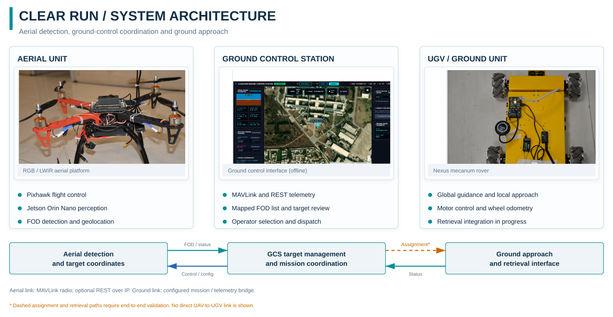

One engineering programme connects three layers: **dataset/model development → airborne edge deployment → UAV–GCS–UGV mission integration**.

## At a glance

| Dimension | Current state |
|---|---|
| Problem | Detect, geolocate and ultimately retrieve runway Foreign Object Debris |
| Dataset | **3,499 LWIR source frames · 5,593 annotated objects · 23 classes** |
| Experiment programme | **29 completed training runs** across YOLOv8 / YOLO11 / YOLO12 configurations plus current multi-model LWIR work |
| Edge deployment | Jetson Orin Nano · FP16 TensorRT · UAV flight trials |
| Historical throughput | **25.0 FPS TensorRT-stage · 15.6 FPS end-to-end** ten-run summaries; raw per-run logs and historical engine not retained |
| Integrated runtime | concurrent RGB + passive-IR inference · YOLO/SAHI · geolocation · MAVLink/REST · GCS integration |
| Current verification focus | GCS→UGV hand-off, terminal alignment, physical capture and retained removal |
| My role | technical direction, architecture/interfaces, experiment and evaluation strategy, deployment review, integration gates and team leadership |

**Public dataset:** [TIR-FOD v1.2 — DOI 10.5281/zenodo.22546586](https://doi.org/10.5281/zenodo.22546586) · **Reproducibility:** [29-run result bundle](../evidence/tir-fod/reproducibility/README.md) · **Deployment code:** [sanitized Clear Run detector extract](../evidence/clear-run/README.md)

## 1. TIR-FOD — dataset and controlled model evaluation

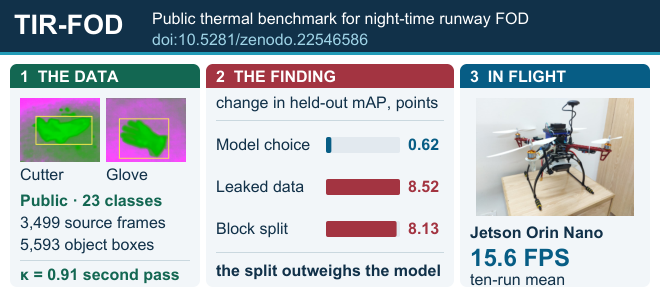

*The research story is evaluation-first: protocol effects from leakage and acquisition-block partitioning materially exceed the spread attributed to model choice. The flight-throughput figure is retained as a historical system measurement, not a checkpoint-reproducible benchmark.*

The released study contains **3,499 single-shot LWIR source frames**, **5,593 bounding-box annotations** across **23 FOD classes**, a larger offline-augmented archival pool, frozen source-lineage-aware partitions and a blind second annotation pass on **338 frames**.

The experiment programme includes **29 completed training runs** across YOLOv8n, YOLOv8s, YOLOv8m, YOLO11s, YOLO11m and YOLO12s.

Key results:

- best observed three-seed YOLOv8n mean mAP@[.50:.95]: **0.8603 ± 0.0017**;
- a size-matched contamination experiment increased mAP@[.50:.95] by **8.52 ± 0.19 percentage points**;
- on the shared 12-class experiment, acquisition-block-disjoint evaluation produced **0.7410 ± 0.0423**, compared with **0.8223 ± 0.0070** under frame-level partitioning.

The important engineering result is that **data lineage and capture-session structure materially changed the apparent model conclusion**.

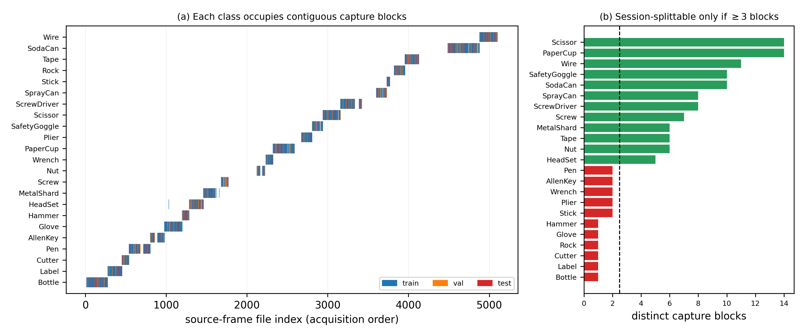

*Acquisition-session structure is treated as an evaluation variable rather than hidden inside a random frame split.*

### Model lifecycle

The workflow includes configuration-driven resumable experiment queues, deterministic multi-seed training, recorded protocol deviations, validation-selected checkpoints, held-out test evaluation, per-class metrics, run histories, initializer checksums, experiment manifests, model conversion and deployment profiling.

## 2. Jetson / TensorRT flight deployment

  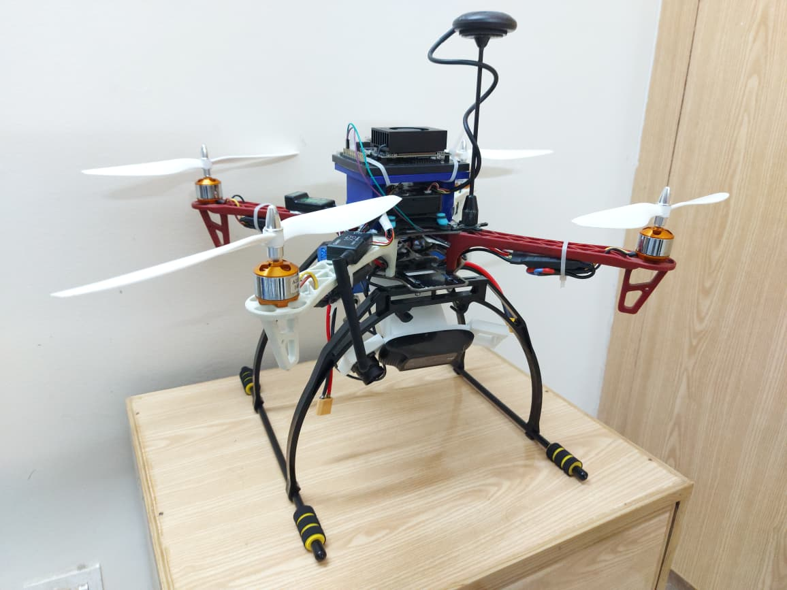
  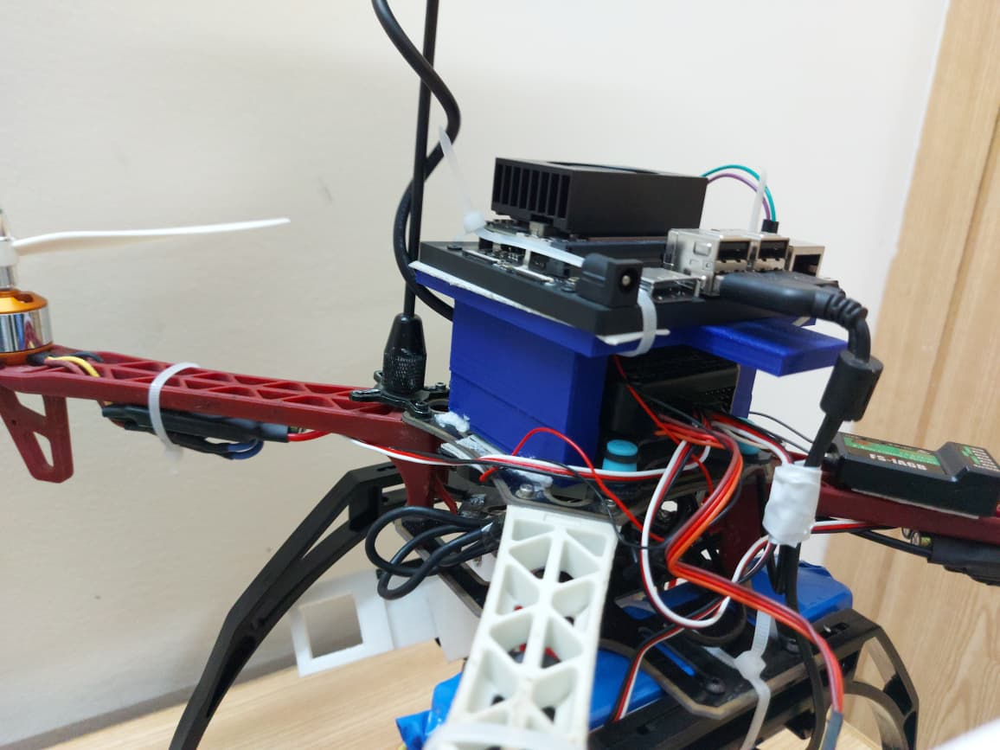

  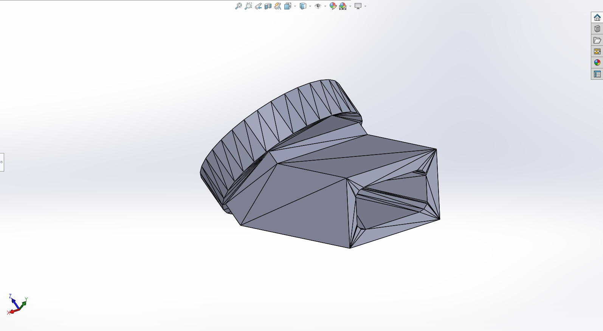

*Authentic programme hardware: complete UAV, installed Jetson compute and camera payload integration. These images are retained from the project evidence set; they are not stock or generated illustrations.*

The thermal detector was deployed on **Jetson Orin Nano** with a thermal payload and GNSS/Pixhawk flight stack and exercised through repeated runway UAV trials.

  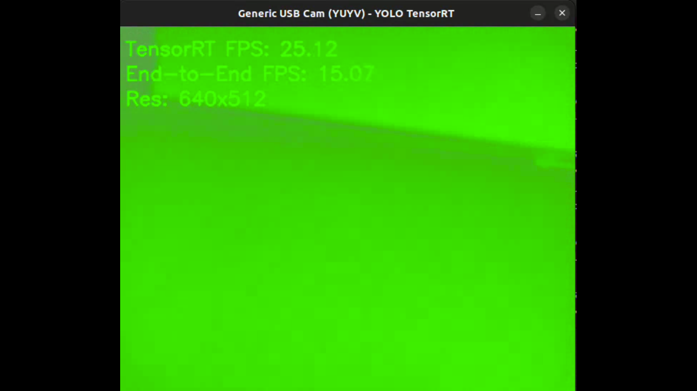

Historical records include onboard TensorRT inference, successful detections, misses and false detections, an author-confirmed ten-run mean of **25.0 FPS TensorRT-stage**, and **15.6 FPS end-to-end** with reported range **15.07–16.0 FPS**. The retained runtime display above records **25.12 FPS TensorRT / 15.07 FPS end-to-end**.

The raw ten-run logs and historical TensorRT engine were not retained, so those figures remain historical system measurements rather than checkpoint-reproducible benchmarks. A newer [named-checkpoint protocol](../evidence/tir-fod/deployment/named_checkpoint_protocol.json) requires hashes, per-frame timing and retained telemetry.

## 3. Clear Run — mission-system integration

Clear Run extends the perception work into an aerial-ground system with RGB and passive-IR streams, independent FP16 TensorRT models, YOLO/SAHI processing, synchronized recording, geolocation, MAVLink/REST interfaces, a purpose-built GCS, and a developing UGV retrieval layer.

  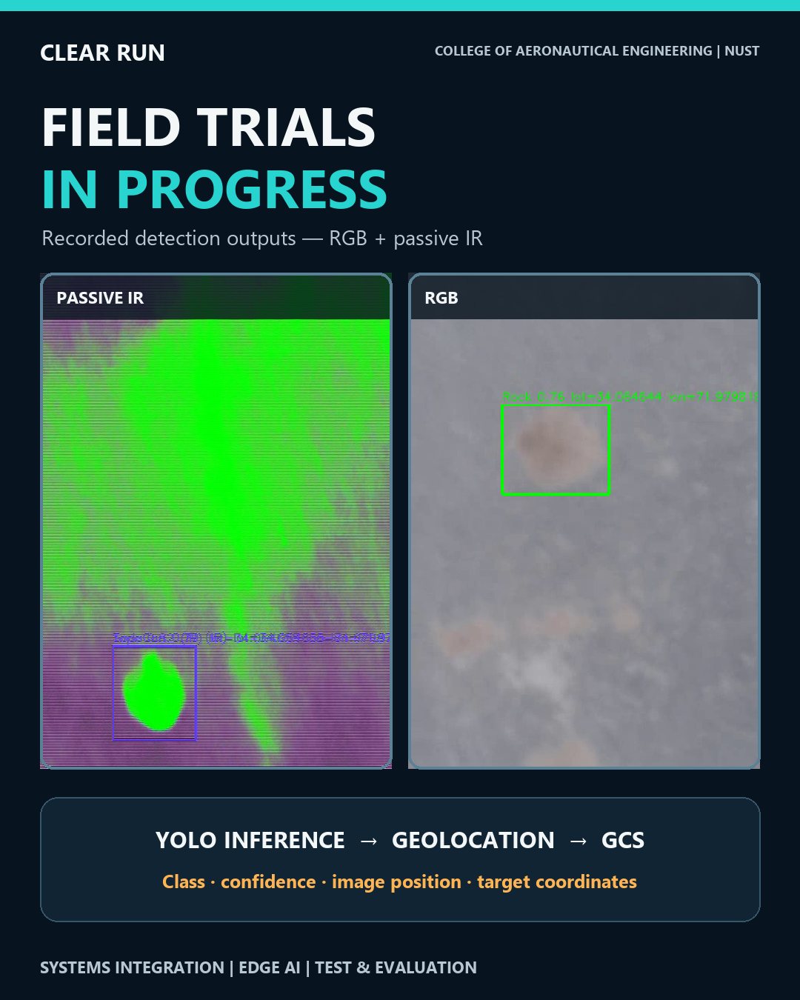

*Recorded field-video evidence is retained in the programme archive. The public case study surfaces representative frames and the machine-readable event snapshot; these records demonstrate field inference output but are **not** used as precision/recall, geolocation-accuracy or mission-success metrics.*

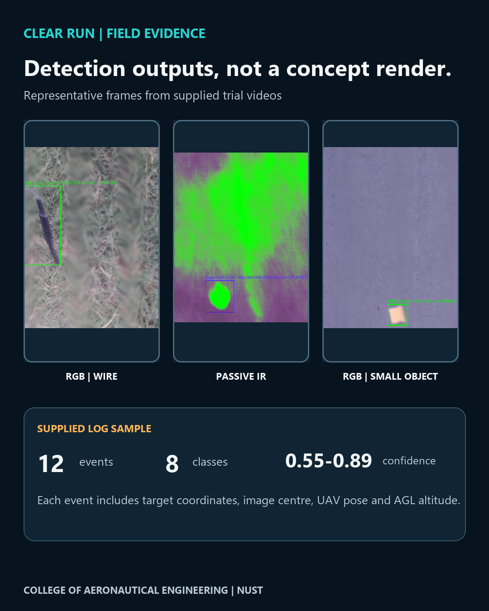

Current field records demonstrate annotated RGB and passive-IR detections with class, confidence and target-coordinate outputs. The reviewed snapshot contains **8 unique trial videos** (5 RGB, 3 IR; approximately 12 min 45 s total) and **12 structured RGB event records across 8 reported classes**. Those records carry image location, target coordinates, UAV pose and altitude. Recorded model confidence spans **0.5488–0.8887** (mean **0.7125**) and logged altitude spans **1.176–2.334 m AGL** (mean **2.069 m**). These are pipeline/event statistics, not detector or geolocation accuracy.

The aggregate, non-location-sensitive snapshot is published as [`field_trial_snapshot.json`](../evidence/clear-run/field_trial_snapshot.json) and validated in CI.

  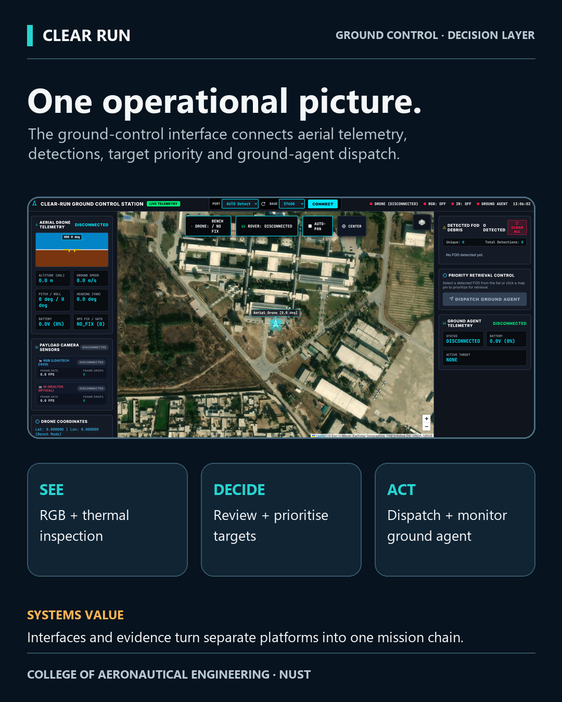
  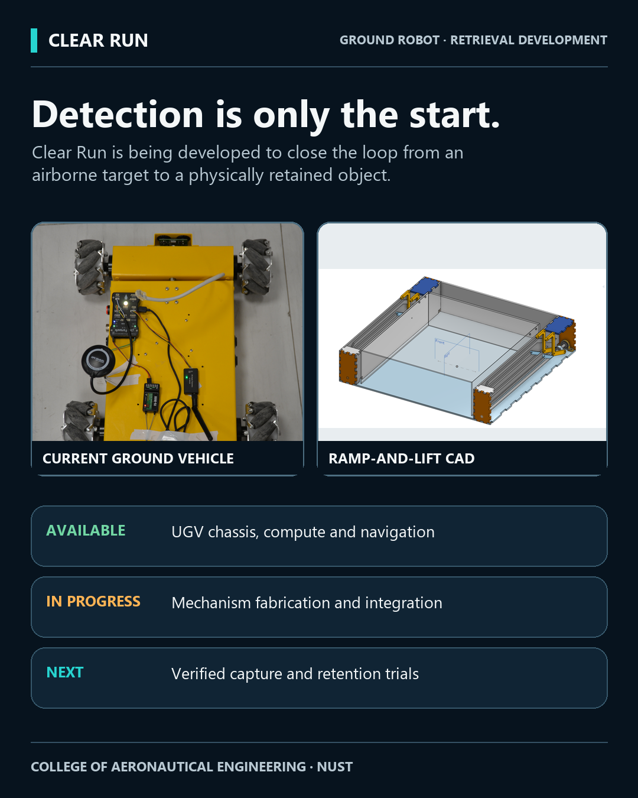

The GCS consolidates aerial telemetry, detection review, target prioritisation and ground-agent dispatch. The UGV layer combines mecanum mobility, embedded compute/navigation and the retrieval mechanism under fabrication/integration.

### Subsystem engineering views

These views come from the programme's reviewed architecture set and retain authentic project imagery/interface captures. They are functional system views rather than decorative redraws.

  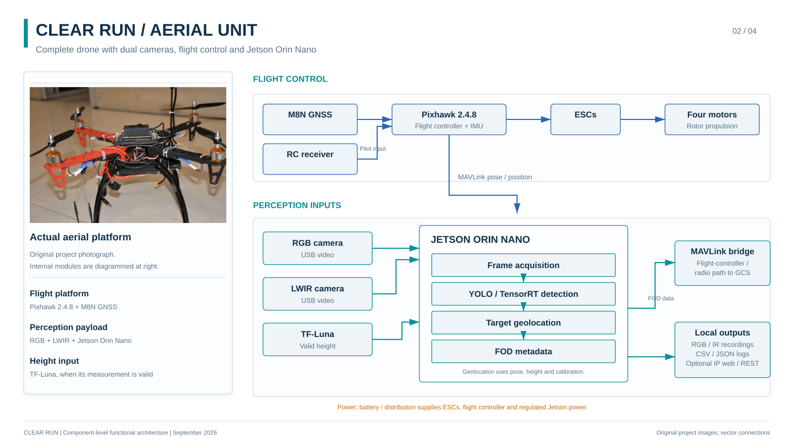

  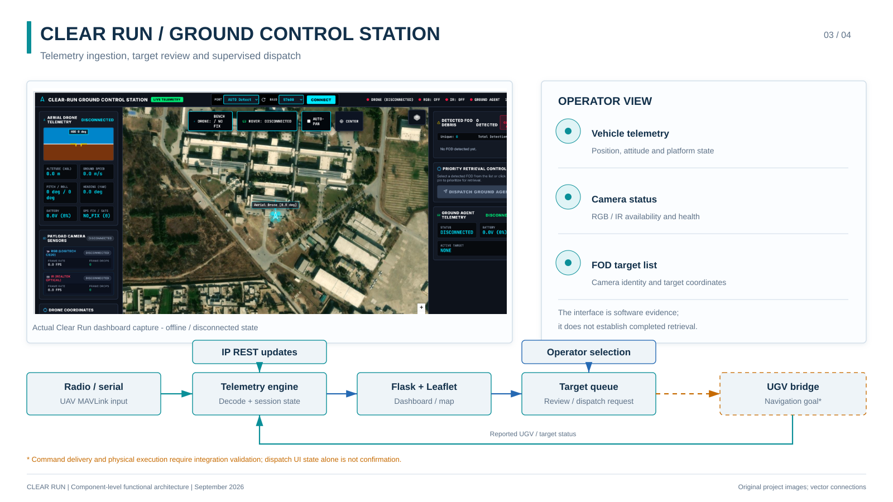

  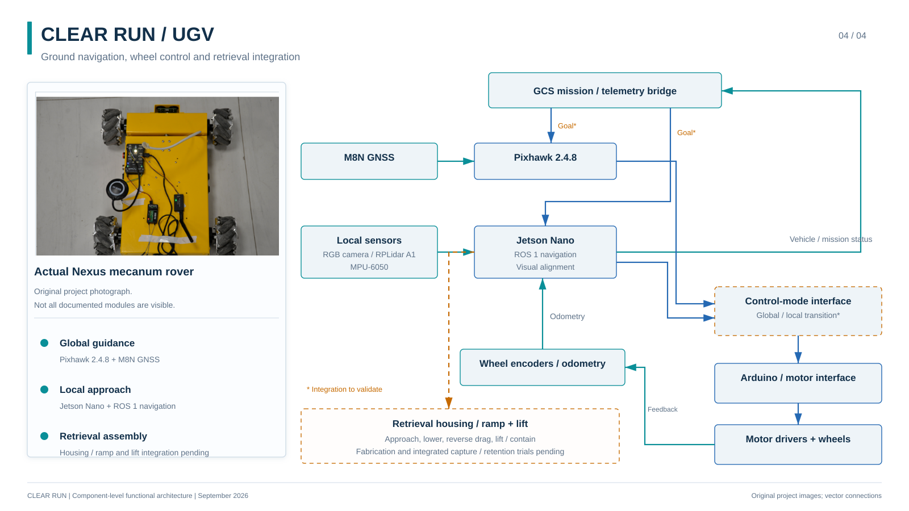

The dedicated GCS view makes the operator/telemetry/target-handling layer inspectable at useful scale; the Aerial and UGV views preserve the component and interface context on either side of that hand-off.

### Mission verification status

| Mission stage | Evidence status | Quantitative closure required |
|---|---|---|
| RGB / passive-IR detection output | Demonstrated | trial denominators / ground truth for detection-performance metrics |
| Structured target-event logging | Demonstrated | persistence / tracking behavior under declared test conditions |
| Target geolocation | Coordinates produced | surveyed-target error distribution |
| GCS ingest / target handling | Implemented evidence | traced response/identity measurements across the deployed path |
| GCS → UGV assignment | Open measurement | acknowledgement success, latency, retries/failures |
| UGV approach / terminal alignment | Open measurement | arrival/alignment error, time-to-target, interventions |
| Physical capture | Development | success rate by object/geometry/approach condition |
| Retention after movement | Open measurement | retained-capture success under declared motion profile |
| Full detection → retention mission | Open measurement | end-to-end success with one traceable object identity |

The machine-readable [`mission_verification_matrix.json`](../evidence/clear-run/mission_verification_matrix.json) makes those gates explicit and is checked in CI so an intermediate subsystem cannot silently become a completed-mission claim. The final detection-to-physical-retention chain is still being quantitatively closed.

## Engineering impact

- **Leakage risk was quantified:** a controlled contamination experiment showed an invalid **+8.52 ± 0.19 percentage-point** uplift.
- **Generalisation was tested against acquisition shift:** block-disjoint evaluation produced a materially harder result than frame-level partitioning.
- **Deployment exposed system overhead:** inference-stage and end-to-end throughput are treated as different metrics.
- **The programme spans the mission chain:** sensing, inference, geolocation and GCS integration are active while hand-off, terminal alignment, collection and retention remain explicit integration gates.
- **Reusable engineering assets were created:** public data, split records, repeated-run metrics, training protocols, deployment measurement protocols and sanitized runtime code.

## My role

I lead the applied R&D / systems-engineering effort: technical direction, architecture and interfaces, experiment design, model/evaluation strategy, deployment review, integration gates, KPI definition, multidisciplinary student/research teams and publication development.

## Research status

- TIR-FOD dataset v1.2 is publicly released on Zenodo.
- The related IEEE Access manuscript remains under revision in 2026.
- Clear Run remains under active field integration and measurement.

[Back to main page](../README.md) · [Technical implementation](../evidence/README.md) · [Research record](../research/README.md)
