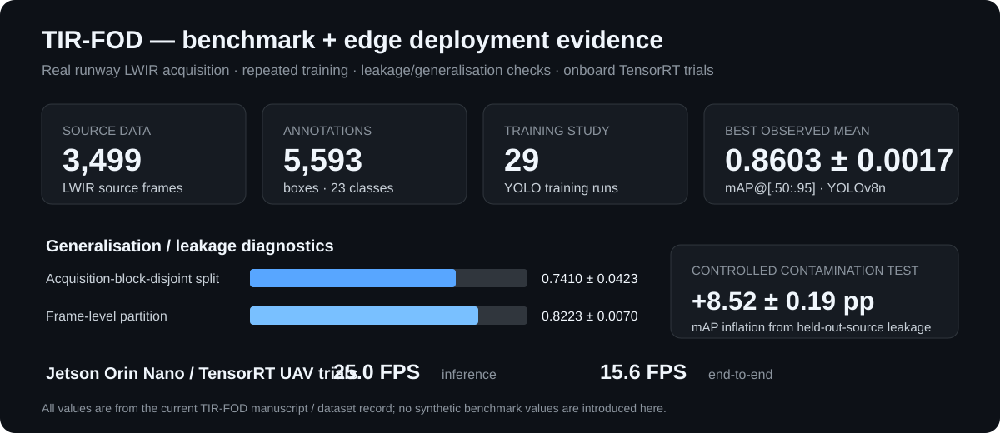
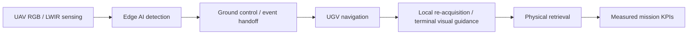

# TIR-FOD / Clear Run — thermal edge AI for runway inspection

## Problem

Foreign Object Debris (FOD) is an aviation-safety hazard. Visible-spectrum inspection becomes weak at night; thermal sensing offers a complementary modality but needs a well-controlled benchmark and real deployment evidence.

## TIR-FOD dataset and benchmark

**Public dataset:** [TIR-FOD v1.2 — Zenodo DOI 10.5281/zenodo.22546586](https://doi.org/10.5281/zenodo.22546586)

**Inspectable result data:** [selected raw benchmark result snapshot](../evidence/tir-fod/benchmark_results.json)

- **3,499** single-shot LWIR source frames acquired over real runway surfaces;
- **5,593** bounding-box annotations;
- **23** FOD categories;
- object-to-camera distances **0.5–10 m**;
- offline archival pool **29,243 images** after augmentation;
- frozen source-grouped partitions;
- blind second annotation on **338 frames** plus automated checks;
- **29 training runs** across YOLOv8, YOLO11 and YOLO12 configurations and comparative studies.

The SVG above is a visualization of measured project results, not generated project imagery. The JSON snapshot exposes representative raw benchmark fields so the numbers can be inspected directly.

## Model and generalisation evidence

- best observed three-seed mean mAP@[.50:.95]: **0.8603 ± 0.0017** with a 3.0M-parameter YOLOv8n configuration;
- observed detector means span only **0.0062**, so the work reports repeated-seed variability rather than presenting one lucky run;
- a size-matched held-out-source contamination experiment increased mAP@[.50:.95] by **8.52 ± 0.19 percentage points**, directly quantifying how leakage can make an augmented benchmark look better than it generalises;
- on a shared 12-class source pool, acquisition-block-disjoint partitioning produced **0.7410 ± 0.0423**, versus **0.8223 ± 0.0070** for frame-level partitioning.

The important engineering point is not the headline mAP. It is the evaluation discipline: source lineage, repeat seeds, contamination testing, acquisition-block separation, annotation checks and size-resolved analysis.

## Edge deployment

The pipeline was taken onto a **Jetson Orin Nano** with **TensorRT** and flown with a thermal payload during runway trials.

Ten-run means reported in the current manuscript:

- **25.0 FPS** inference;
- **15.6 FPS** end-to-end.

This moves the work from a dataset/model study toward an operational AI system: sensor acquisition, preprocessing, model execution, deployment constraints, telemetry and field validation.

## Clear Run extension

Clear Run extends perception into a supervised end-to-end inspection/retrieval research system:

The current programme is explicitly treated as an **experimental platform**, not an unattended runway-clearance claim. Current and planned KPIs include detection/dispatch losses, location error, end-to-end latency, retrieval success, object-size envelope, terminal alignment, intervention rate and retained-object outcome.

## My role

I lead the applied R&D / systems-engineering effort: technical direction, experiment design, architecture, integration gates, performance/KPI definition, deployment review, student engineering teams and research/publication development.

## Research record

The TIR-FOD IEEE Access manuscript is under revision. The public dataset is already released independently so the underlying benchmark can be inspected and reused while manuscript review continues.

[Back to portfolio](../README.md) · [Research record](../research/README.md)
